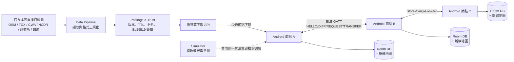

# Resilient Geo Mesh

> 極端通訊環境下的空間情報系統 — 當基地台總頻寬受限時，讓附近的手機彼此交換各自缺少的災情資料分片。

> 2026-09-24 更新：Android App 的 launcher 現在是 Flutter module 的全台灣離線地圖；Android 原生保留 Room、事件驗證／TTL、BLE 與 transport harness，Flutter 透過 bridge 只讀取已驗證事件。

## 問題與目標

災害發生時通訊資源下降，但民眾與救援人員對「最新空間資訊」的需求反而急遽上升。現有地圖與防災服務多半依賴持續連網下載，因此會出現**有訊號、卻來不及取得關鍵資訊**的情況：地圖載不出來、關鍵資訊跟不重要的資訊一起搶頻寬、災前下載的離線地圖沒有災後新增的道路封閉與避難所滿載。

這不是假想情境。NCC 2025 Q1 統計行動通訊用戶約 2,879.5 萬、單季行動數據傳輸量 3,067.6 PB；2025 年丹娜絲颱風造成 1,293 座行動基地台受影響、12,296 戶市話中斷；2026 年城鎮韌性演習更首次納入大規模行動網路降速，14 個縣市、每次 30 分鐘，官方新聞稿記載將下載速率調降至 **256 KB** 等級。**降速、而不是斷網**，就是本專案設定的主要情境。

我們先盤點了既有解法，每一種都有明確的缺口：

| 現有方式              | 做法                             | 缺點                                                           |
| --------------------- | -------------------------------- | -------------------------------------------------------------- |
| 提前下載離線地圖      | 事前下載防災 App、避難地圖、截圖 | **只解決靜態資料**，災後新出現的道路封閉、避難所滿載完全不知道 |
| SMS / CBS 災防告警    | 簡訊或細胞廣播傳送警報           | 極省流量，但**單向、廣播式**，難做個人化路線與附近資源分析     |
| Wi-Fi / 固網 / 市話   | 行動網路慢時改用固定網路         | 必須**附近剛好有可用基礎設施**，不適合正在移動或身處災區的人   |
| 行動基地台 + 低軌衛星 | 災區部署基地台車、OneWeb、微波   | 很重要，但**設備、數量、人力有限**，無法立刻覆蓋所有民眾       |
| 災害漫遊              | 自家基地台損壞後改用其他業者網路 | 解決「沒訊號」，但**不代表頻寬充足**，另一家網路也可能塞爆     |

缺口很清楚：**沒有人處理「災後才發生、必須即時送到每個人手上的那一小塊動態資料」在總頻寬不足時要怎麼散播。** 因此本專題把範圍收斂到資訊的 mesh 交換。

核心洞察，也是本專案唯一想證明的事：

> 在 256 kbps（約 32 KB/s）的降速情境下，mesh **不可能比基地台快** — 我們實測 BLE GATT 只有 3.8–4.4 KB/s，比降速後的基地台還慢 5–10 倍。mesh 的價值不在速度，而在於**不要讓 100 個人從同一座基地台重複下載同一份資料**，把稀缺的總頻寬留給還沒拿到資料的人。

**目標使用者**：災害或演習期間身處降速區域的一般民眾，以及需要掌握現場動態的第一線人員。

**預期影響**：以內湖區 ~500 筆事件、50 節點的可重播模擬為例，加入 peer 交換後資料覆蓋率由 65% 提升到 100%，同時約 87–91% 的位元組不再向伺服器索取。

**定位**：這是既有行動網路、衛星、LoRa、基地台車之外的**額外韌性層**，不取代既有通訊，也不宣稱能創造額外的基地台頻寬。

## 核心功能

- **Flutter 離線優先的災情地圖** — MapLibre 讀取以 Git LFS 管理的台灣 Protomaps PMTiles 向量底圖，並疊加本機行政區、離島、著名地標與道路搜尋索引；避難所、醫療院所與事件以版本化 asset／Room 提供。關掉網路、強制結束 App 再重開，地圖與已驗證事件照常顯示，並以 CURRENT／EXPIRED／UNVERIFIED 分色標示新鮮度與可信狀態。
- **Peer-to-peer 分片交換** — 兩台手機經 BLE GATT 完成 `HELLO`（交換資料集摘要）→ `DIFF`（算出雙方缺哪些分片）→ `REQUEST`（依 critical／稀有度／大小／TTL 排序）→ `TRANSFER`（分段、位元組級可中斷續傳）→ `VERIFY/APPLY`（驗證後原子寫入），**只交換對方缺少的分片**。
- **Store-Carry-Forward（DTN）** — A 傳給 B，B 移動後遇到 C 再傳給 C；A 與 C 從不需要同時連線。已用三台實機驗證：force-stop A 之後，C 仍經 B 收到並驗證全部事件。節點會把通過驗證的分片記進本機庫存，因此收到資料後能對下一個 peer 如實宣告「我有這些」，而不是回報空手。
- **端到端可信度** — 伺服器端以 Ed25519 簽章，手機端在寫入前驗證 hash、簽章、版本與 TTL。版本倒退一律拒絕；官方資料與群眾回報分屬不同 namespace，永不互相覆蓋。私鑰從不進入 repo，也不隨 App 出貨。
- **民眾回報 + 政府查證** — 民眾在地圖上回報災情（道路阻斷、淹水、火災／煙霧、受困／受傷、其他）。Flutter 只送表單欄位；Android 組成 `crowd.reports` 事件，用裝置自產的 Ed25519 金鑰簽章（公鑰隨事件送出、key id 即公鑰指紋），再走和收到的資料完全相同的驗證流程寫入 Room。回報一律標為 `UNVERIFIED`，地圖上以紫色顯示「未經查證，僅供參考」，並以一筆一分片的方式經 mesh 轉傳，中繼節點不重新簽章。政府端用 `pipeline/cli.mjs attest` 簽發獨立的 `official.verified` 確認事件，以 `payload_hash` 指回原回報；手機收到後顯示「已查證」或隱藏「查證為假」的回報。裝置金鑰只能簽 `crowd.*`，官方資料的信任規則不變。沒有政府端時，回報照樣可以流通。
- **離線逃生路線** — Android 用打包的內湖 OSM 步行路網和 Room 裡已驗證的事件，在手機上計算到避難所的步行路線，不呼叫任何路線 API。封閉道路與 CRITICAL 淹水／土石流範圍會被避開，部分封閉與高風險區加權，群眾回報只加權、不封鎖；額滿或未開設的避難所會被排除並說明原因。mesh 帶來新事件後，畫面提示重新計算，路線會改道或換目的地。
- **Emergency Mode** — 使用者手動開啟、有明顯狀態提示的前景服務。開啟後持續進行 BLE 廣播與掃描，在鎖屏、App 切到背景時仍維持運作，通知列即時顯示附近節點數。發現附近節點後，`AutoPeerSyncEngine` 會**自動**跑 HELLO → DIFF → REQUEST → TRANSFER，不需要任何人操作。這裡不需要協商角色：兩邊都送出自己的 HELLO，各自向對方請求自己缺的分片，也各自回應對方的請求，因為 `computeDiff`／`buildRequest` 本身就是對稱的。通知列會顯示已同步的分片數。（目前只有 JVM 與 instrumented 測試，**尚未做實機驗證**，見下方限制。）
- **可重現的量測工具** — 決定性 DTN 模擬器比較「無協作／一般 replication／rarest-first」三種策略 × 10/20/50/100 節點 × 地理過濾開關，產出 Coverage、Freshness、Cellular Savings、Transfer Efficiency 四項指標報告，固定 seed 可位元比對。

## 系統架構



**協作方式**：後端（`pipeline/`）是純 Node.js CLI，負責把多來源資料正規化成統一的 `event-v0` 格式，依 `(area_id, theme)` 分組切片、計算 canonical SHA-256 並以 Ed25519 簽章，輸出 manifest + chunks。**私鑰只存在伺服器端**。行動端（`android/`）在收到任何分片時，先由 `ChunkVerifier` 驗證 chunk hash 與簽章、再由 `EventVerifier` 逐筆驗證事件，最後才交給 `EventIngestor` 套用版本／TTL／namespace 規則寫入 Room；驗證不過的資料絕不進入 APPLY，也不覆蓋既有資料。傳輸層藏在 `PeerTransport` 介面後方（實作為 `BleGattTransport`），同步邏輯不綁死任何單一 Android API。模擬器（`simulator/`）刻意**共用手機端同一套 `computeDiff`／`buildRequest`／驗證邏輯**，只把傳輸層換成種子化的接觸模型，因此模擬結果與實機行為出自同一份決策程式碼。

沒有雲端資料庫、沒有後端服務相依；唯一的例外是把民眾回報升級為「已查證」需要政府端簽發確認事件，但沒有政府端時系統照常運作。App 固定使用單一 `MapLibreMap` renderer：台灣 Protomaps PMTiles、glyph、sprite、樣式、行政區／地標 GeoJSON 與 `taiwan-roads.json` 搜尋索引全部隨 App 內嵌；Android 啟動時將 PMTiles 串流複製到 app-private `files/maps/`，因此地圖與道路搜尋不需要網路或地圖服務憑證。ADR-001 否決的 Nearby Connections 與 Wi-Fi Direct 實作已連同它們所需的 Wi-Fi／Play Services 權限一併移除，只保留在 git 歷史與 ADR 記錄中。

## 使用技術

| 類型               | 技術／服務                                                                            | 用途                                                                                                                              |
| ------------------ | ------------------------------------------------------------------------------------- | --------------------------------------------------------------------------------------------------------------------------------- |
| AI 模型            | 未使用                                                                                | 本專案為協定與傳輸層研究，不涉及模型推論；所有排程決策（critical-first、rarest-first、地理過濾）皆為決定性規則，以利可重現量測    |
| 前端（行動端）     | Kotlin Android host（minSdk 26／targetSdk 37）+ Flutter module                        | Flutter launcher、Room／BLE bridge、Emergency Mode 權限與原生服務                                                                 |
| 前端（地圖）       | Flutter `maplibre_gl` + Protomaps PMTiles                                             | 台灣 z0–12 概覽與北／中／南／東 z13–15 街道向量資料；z17 僅為 overzoom；疊加行政區／離島／地標標籤、Lucide 災情、避難所、醫療 marker 與事件 GeoJSON 圖層 |
| 後端（資料管線）   | Node.js（零外部相依，僅用內建模組）、`node:crypto` Ed25519                            | 來源擷取、正規化、分片、簽章與驗證 CLI                                                                                            |
| 後端（模擬與分析） | Node.js 決定性模擬器、`node:test`                                                     | DTN 擴散模擬、四指標報告、位元級可重現性檢查                                                                                      |
| 資料庫             | Room 2.6.1 / SQLite（KSP 註解處理）                                                   | 手機本機事件、版本、到期時間儲存                                                                                                  |
| 密碼學             | Bouncy Castle `bcprov-jdk18on` 1.78.1                                                 | Android 端 Ed25519 驗簽（平台 provider 至 API 33 才支援 EdDSA）                                                                   |
| 傳輸層             | Android BLE GATT（自訂 service：DATA write／ACK notify／CONTROL characteristic）      | Peer discovery、連線、分片傳輸與位元組級續傳                                                                                      |
| 資料契約           | JSON Schema（`event-v0`／`manifest-v0`／`chunk-v0`／`peer-summary-v0`／`feature-v0`） | 跨模組介面，pipeline 與 Android 各自實作、以同一份 fixture 交叉驗證                                                               |
| 測試               | Flutter test、JUnit 4、AndroidX Test、`node:test`、Python `unittest`                  | 83 項 Flutter 測試、48 項 JVM 單元測試、14 項 instrumented 測試、122 項 Node 測試、6 項 Python 測試                               |
| Sponsor 技術       | 未使用                                                                                | 本次未使用主辦方或贊助商提供的服務；pipeline 與 simulator 零第三方相依，Android 端僅用 AndroidX 與 Bouncy Castle                  |

> 曾評估但**否決**的技術，實測記錄見 [`docs/adr/ADR-001-transport-layer.md`](docs/adr/ADR-001-transport-layer.md)：**Nearby Connections**（兩台實機皆回傳 Google 側 `INTERNAL_ERROR`，非 App 端可控）、**原生 Wi-Fi Direct**（discovery／連線可行，但 TCP 卡在疑似 Android per-app 網路路由限制）。

## 安裝與執行

### 需求

- Node.js 20+（pipeline 與 simulator，無需 `npm install`，零外部相依）
- Python 3.10+（replay 測試，僅用標準庫）
- Flutter 3.29.2／Dart 3.7.2（台灣離線地圖 module）
- JDK 17+ 與 Android SDK（Android App；Android Studio 內建的 JBR 即可）

```bash
git clone https://github.com/Jiruiii/OSS.git
cd OSS

# ---------- 1. 驗證整套資料契約與模擬器（不需要手機，約 1 分鐘） ----------
npm test                                   # 122 項通過（pipeline + simulator）
python -m unittest discover -s tests -v    # 10 項通過（Windows 繁中環境請先設 PYTHONUTF8=1）

# ---------- 2. 產生並驗證一份真實簽章的資料封包 ----------
node pipeline/cli.mjs keygen --out-dir .stage2-keys --key-id neihu-demo-2026
node pipeline/cli.mjs build \
  --input data/fixtures/neihu/demo-v136.json \
  --out-dir .neihu-bundle \
  --private-key .stage2-keys/private-key.pem \
  --key-id neihu-demo-2026
node pipeline/cli.mjs verify \
  --manifest .neihu-bundle/manifest.json \
  --chunks-dir .neihu-bundle/chunks \
  --public-key .stage2-keys/public-key.pem \
  --now 2026-09-01T08:00:00Z

# ---------- 3. 重現實驗報告（三種策略的差異） ----------
node simulator/cli.mjs run --nodes 50 --strategy no-coop      --seed 20260904 --out .sim-out
node simulator/cli.mjs run --nodes 50 --strategy rarest-first --seed 20260904 --out .sim-out
node simulator/cli.mjs run --nodes 50 --strategy rarest-first --seed 20260904 --geo-filter --out .sim-out
node simulator/cli.mjs matrix --check      # 位元比對已提交的 experiments/results/，應為 PASS

# ---------- 4. Flutter Chrome UI ----------
cd flutter
git lfs pull
flutter pub get
flutter run -d chrome --no-web-resources-cdn --web-port 8787

# Chrome 離線 preview（先建置，再由本機 static server 提供）
flutter build web --release --no-web-resources-cdn
python3 -m http.server 8788 --directory build/web

# ---------- 5. Android 離線地圖（需實機或模擬器） ----------
# 先建立 android/local.properties，內容為 sdk.dir=<Android SDK 路徑>
cd ../android
./gradlew assembleDebug                    # 產生含台灣 PMTiles 的 debug APK
./gradlew installDebug                     # 安裝到已連線的裝置

# ---------- 6. Android／資料層測試 ----------
./gradlew testDebugUnitTest                # 48 項 JVM 單元測試
./gradlew connectedDebugAndroidTest        # 14 項 instrumented 測試（需接實機）
```

地圖搜尋是離線本機查詢：`flutter/assets/map/search/taiwan-roads.json` 由指定日期的
Geofabrik Taiwan OSM PBF 產生，資產內保存 `source_url`、`source_sha256`、snapshot
日期與 `© OpenStreetMap contributors` attribution。可輸入道路名稱或
`latitude, longitude`（例如 `25.011549, 121.545053`）；執行期間不呼叫 Nominatim、
Google Geocoding 或 Places API。PMTiles 的分區街道資料上限是 z15，z17 只代表向量
overzoom，不宣稱有 z17 的新增巷弄資料。完整重建與 hash 驗證命令見
[`tools/maps/README.md`](tools/maps/README.md)。

Chrome debug 使用本機 MapLibre GL JS、PMTiles、glyph、sprite、CanvasKit 與 UI
字型；`--no-web-resources-cdn` 會避免 Flutter engine 從 gstatic 下載資源。要做
真正的無網路檢查，使用上面的 release preview，在瀏覽器 Network 面板確認請求都
留在 `localhost`。

App 主畫面直接進入 Flutter 台灣離線地圖，提供道路／建物／水域／POI 向量底圖、縣市到村里的分級地名、離島與著名地標、避難所／醫療院所／事件圖層、本機搜尋、百分比縮放、目前位置、圖層設定、點位詳情與重疊點位選擇；避難所、醫療院所與事件 marker 在縮小時會聚合成圓點，點擊後再展開或進入下一層。下方另有首頁、通知、個人設定三個頁籤。「載入內建 fixture」與 Emergency Mode 仍由 Android bridge 執行。Peer Sync、BLE spike 與量測畫面是 debug-only 的原生測試 harness，不放在一般地圖主畫面。

**兩機 peer sync 實測**需要兩台開啟藍牙的 Android 裝置，debug APK 可由 Android Studio 啟動對應的 `PeerSyncMilestoneActivity`，再分別指定 NODE_A（requester）／NODE_B（server）角色。逐步 demo 講稿見 [`experiments/demo.md`](experiments/demo.md)；Android 端建置細節與踩雷紀錄見 [`android/README.md`](android/README.md)。

### 實測與模擬結果摘要

實機（Pixel 7 / Pixel 8a / Sharp SH-M32）：

| 項目                     | 結果                                                                                                                |
| ------------------------ | ------------------------------------------------------------------------------------------------------------------- |
| BLE GATT 吞吐量          | 3.8–4.4 KB/s（10s／30s／60s 接觸窗多輪量測）                                                                        |
| 斷點續傳                 | 位元組級續傳成功（中斷點回報的 `bytesTransferred` 直接作為下次 `resume()` 的 offset）                               |
| 跨品牌相容性             | Google Pixel（API 37）+ SHARP（API 35），滿足「兩品牌、兩 Android 版本」                                            |
| 三機 Store-Carry-Forward | A 完全 force-stop 後，C 仍經 B 收到並驗證全部 4 筆簽章事件（含一個中斷又續傳的 chunk）                              |
| 不重複下載（核心主張）   | 第二次相遇時 `DIFF: missing=[]`，「already in sync」——節點從本機庫存如實宣告持有，一個 byte 都不重傳                |
| 連線成功率               | 亮屏 17/20（85%，p50 289ms）；**鎖屏 0/19（0%）** — 這正是 Emergency Mode 需要前景服務的直接證據                    |
| 耗電                     | baseline 385 mW → Emergency Mode 439 mW（**+54 mW，+14%**，螢幕關閉、6 輪交錯各 60 筆）；約等於每小時多耗 0.3% 電量 |

模擬（內湖五個生活圈、約 500 筆事件、24 回合 × 30 秒，以 50 節點為例）：

| 策略                      | Coverage (final) | Cellular Savings | Freshness p50 |
| ------------------------- | ---------------: | ---------------: | ------------: |
| `no-coop`（各自下載）     |            65.1% |               0% |          360s |
| `replication`（一般 P2P） |             100% |            87.1% |          150s |
| `rarest-first`            |             100% |            86.6% |          150s |
| `rarest-first` + 地理過濾 | 100%（relevant） |        **91.3%** |      **120s** |

完整 24 格矩陣、ASCII 曲線與每個區塊的樣本數見 [`experiments/results/report.md`](experiments/results/report.md)。

## 作品展示

- 評選影片：<!-- TODO：請填入影片連結 -->

## 限制與未來工作

如實揭露，不是藉口：

**已知限制**

- **地圖與靜態點位是版本化快照；App 仍不直接呼叫官方 API。** 地圖幾何與道路索引取自 OSM／Protomaps 快照，避難所與醫療院所使用已保存的政府資料快照；pipeline 已完成 NCDR 真實全台 snapshot smoke test，但事件尚未由正式部署的 pipeline 持續供應到 App。TDX／CWA 仍待各自的正式 live smoke test。
- **不宣稱在任何固定時間覆蓋全城。** 所有模擬數字只適用於 [`experiments/scenario.md`](experiments/scenario.md) 描述的內湖情境與接觸模型，單一 seed，非多次抽樣的信賴區間。
- **模擬參數只校準了一半。** `max_bytes_per_round` 已用實機 BLE 接觸窗量測校準；`contact_probability`（社交接觸機率）與 `transfer_failure_prob` 仍是工程估計值 — 現有實機數據沒有一項直接對應到這兩個參數，硬套上去會是假精確。
- **耗電只有單一機型、單一 60 秒視窗、只涵蓋持續傳輸**，不是 Emergency Mode 真實的間歇性接觸型態，也未涵蓋鎖屏情境。
- **Emergency Mode 的自動同步還沒做實機驗證。** `AutoPeerSyncEngine`（PR #18）已經接進前景服務，有 JVM 單元測試與 instrumented 測試，但還沒在兩台以上的實機上跑過「開著 Emergency Mode 放著，自己完成交換」的情境。上方實機結果表裡的同步數據全部來自手動操作的 Peer Sync 畫面。
- **民眾回報與逃生路線尚未做實機驗證。** 兩者都有 JS／Kotlin JVM／Flutter 自動化測試（含用真實簽章重播 A→B→C 轉傳，以及逃生路線的三步驟 demo 情境），但還沒在實機上跑過。回報送到政府端、確認事件送回手機，目前都靠 debug build 的 `adb` 匯出／匯入。裝置金鑰沒有撤銷機制，同一把金鑰的回報可以被串起來；「N 人回報」可以被一人多機灌票，所以不等於驗證。
- **逃生路線只有步行、只涵蓋內湖**，沒有高程資料、`oneway` 標籤，避難所開設狀態靠位置比對，也不依災害類型過濾避難所；內湖以外的避難所會顯示「不在離線路網範圍內」。路線不是官方疏散指示。
- **自動同步不支援跨接觸續傳。** 如果接觸窗關閉導致真的斷線，傳到一半的分片不會保留狀態，下次相遇會從第 0 個 byte 重傳。位元組級續傳目前只在同一條連線還開著時有效。
- **鎖屏／背景存活尚未用正式前景服務重跑**（先前一次嘗試因螢幕被意外喚醒而無效），跨機型的 20 次連線成功率統計也尚未補齊。
- **耗電只涵蓋「持續發現」，不含傳輸。** 目前服務不會自行建立 GATT 連線交換分片，所以 +54 mW 是待命成本，實際同步時的耗電尚未量測；且只有 1 台機型、鄰居數固定為 1。（同日稍早那組 22.35→26.78 mW 已作廢——當時手機插著 USB 且滿電，量到的是計量器雜訊，詳見 `experiments/results/energy-raw/README.md`。）
- **手動 Peer Sync 畫面的 server 端仍然從 `assets/` 供應分片。** 自動同步則不同：節點會把驗證通過的分片本體存進本機 `chunk-cache`（上限 8 MB，超過時先刪最舊的），再從這裡供應給下一個 peer，所以中繼節點真的能轉傳自己收到的資料。不過這條中繼路徑同樣還沒做實機驗證。

- **固定大小切分讓版本更新無法真正 delta**：`fixed-size` 切分下，資料集只要有一筆事件變動，同組後面所有 chunk 的邊界就會位移、hash 全變。
- **HELLO 表示法會隨資料集線性膨脹**：目前逐條列舉 chunk（183 chunk 約 36 KB）；全台規模會膨脹到數百 KB，在一次接觸窗內傳不完。

**未來工作**

- 完成 TDX／CWA live smoke test，並把 NCDR 的本機全台 snapshot 接到正式簽章與部署流程，讓 App 只讀取驗證後資料。
- 以 **Bloom filter 或對 manifest 順序的 bitmap** 取代逐條列舉的 HELLO（同樣 183 chunk 只要 23 bytes，省約 1,500 倍），讓資料集可擴展到全台規模。
- 導入**內容導向切分（CDC / rolling hash）或組內單事件對齊**，讓版本更新能真正 delta 傳輸而非整組重傳。
- 補齊跨機型連線成功率統計、鎖屏／Doze 長時存活驗證，以及間歇性接觸模式下的耗電量測。
- 讓 Emergency Mode 服務自行完成連線與同步（含兩台裝置相遇時的自動角色協商），把「開著就會自己交換」變成真的。
- 讓節點能重新供應自己持有的分片位元組，而不只是宣告持有。
- 依實際容量需求擴充 PMTiles 的台灣街道資料與未來離線路徑規劃；第一版資料固定 z15，z17 仍只是 overzoom，不宣稱 z17 巷弄細節。
- 用兩機、三機實機驗證 Emergency Mode 的自動同步與中繼轉傳，並補上跨接觸的續傳狀態保存。
- **民眾回報的後續**：真的上傳 API 與政府端後台（取代 debug 匯出／匯入）、現場授權人員的離線確認（需要授權憑證鏈與撤銷機制）、定期更換裝置金鑰以降低可串連性、信譽評分。
- **逃生路線的後續**：擴大到全台路網、依已打包避難所圖層的 `disaster_types` 過濾、高程與垂直避難建議、以及把 `CONFIRMED` 的封路回報改由政府直接簽發 `ROAD_STATUS`，讓路線真正避開。
- 擴大目前版本化 raster tiles 的覆蓋範圍。

完整版見 [`experiments/limitations.md`](experiments/limitations.md) 與 [`docs/mvp-remaining-tasks.md`](docs/mvp-remaining-tasks.md)。

## 第三方服務、資料與素材

repo 內不含任何 API 金鑰、Token 或個人資料。金鑰僅由本機 gitignored 的 `pipeline/.env` 提供（範本見 `pipeline/.env.example`），且從不寫入 Raw snapshot、fixture、log 或 Android bundle。Ed25519 私鑰只在伺服器端 CLI 執行當下存在，從未提交進 repo。

**資料來源**

| 來源                            | 連結                                                                                          | 授權                                                     | 用途與現況                                                                                                              |
| ------------------------------- | --------------------------------------------------------------------------------------------- | -------------------------------------------------------- | ----------------------------------------------------------------------------------------------------------------------- |
| OpenStreetMap（Overpass API）   | <https://overpass-api.de/api/interpreter>                                                     | ODbL，需標示 attribution（© OpenStreetMap contributors） | 保留內湖 legacy 快照；第一階段 `osm-taiwan` 收集全台醫療／避難所必要 POI，道路仍由台灣 PMTiles 提供                         |
| Geofabrik Taiwan OSM PBF        | <https://download.geofabrik.de/asia/taiwan-latest.osm.pbf>                                    | ODbL，需保留 OpenStreetMap attribution                   | `flutter/assets/map/search/taiwan-roads.json` 的離線道路搜尋來源；產生日期與 SHA-256 保存在資產 metadata                |
| Protomaps daily basemap         | <https://docs.protomaps.com/basemaps/downloads>                                               | ODbL，需保留 OSM attribution                             | 台灣 bbox 與北／中／南／東分區 PMTiles；來源日期、zoom、bbox 與 SHA-256 見 `flutter/lib/data/offline_map_manifest.dart` |
| 臺灣行政區邊界與地名資料         | <https://cdn.jsdelivr.net/npm/taiwan-atlas/towns-10t.json>                                    | MIT（來源為臺灣內政部資料衍生集）                         | `flutter/assets/map/labels/taiwan-reference-labels.geojson` 的縣市、區／鄉鎮、市／村里分級標籤；離線隨 App 載入。同一資產另維護離島名稱與著名地標 |
| 臺北市區界圖                    | <https://data.taipei/dataset/detail?id=1601ef3a-c253-4988-b047-943d9e786143>                  | 臺北市資料開放授權                                       | **僅供 pipeline 的內湖空間過濾**，不是 Flutter 全台底圖來源                                                                   |
| 消防署避難收容處所點位檔        | <https://data.gov.tw/dataset/73242>                                                           | 政府資料開放授權條款第 1 版                              | 第一階段接全台避難所位置；內湖 legacy 快照仍保留。開設狀態另接 <https://data.gov.tw/dataset/12849> XML feed                |
| 醫療機構與人員基本資料          | <https://data.gov.tw/dataset/15393>                                                           | 政府資料開放授權條款第 1 版                              | 第一階段接全台 MOHW ODS 主檔；座標以 NLSC／OSM 補足，無法唯一定位者保留 `unresolved`，不畫 marker                 |
| TDX 運輸資料流通服務 — 道路事件 | <https://tdx.transportdata.tw/api-service/swagger/basic/60abfa19-ffe3-4eef-a4b1-0539435dfca9> | TDX 服務條款與資料授權                                   | 第一階段 collector 支援 OAuth2 與全台端點彙整；真實 snapshot 不提交 repo，App 只接驗證後資料                         |
| 中央氣象署 CWA — 地震與警特報   | <https://opendata.cwa.gov.tw/dataset/earthquake/E-A0015-001>                                  | CWA 氣象開放資料平臺服務條款                             | 第一階段接地震、縣市警報、颱風；API key 僅在 pipeline 本機使用，App 不直接呼叫                                           |
| NCDR 災害示警                   | <https://alerts.ncdr.nat.gov.tw/api_swagger/index.html>                                      | NCDR 平臺條款或來源機關授權                              | 第一階段 adapter 使用 `/api/datastore` → `/api/dump/datastore` 兩階段 CAP API；key 僅在 pipeline 本機使用，App 不直接呼叫 |
| NCC 鄉鎮區基地臺統計            | <https://data.gov.tw/dataset/41256>                                                           | 政府資料開放授權條款第 1 版                              | 僅保留來源 metadata，尚未接入地圖或計算訊號覆蓋／中斷風險                                                             |
| 內政部 20m DTM／DEM·DSM         | <https://data.gov.tw/dataset/176927>                                                          | 政府資料開放授權條款第 1 版                              | 僅保留來源 metadata，尚未接入地圖或地形分析                                                                         |
| Copernicus Data Space（STAC）   | <https://documentation.dataspace.copernicus.eu/APIs/STAC.html>                                | Copernicus Data Space Ecosystem 資料條款                 | 僅保留來源 metadata，尚未下載影像或進行災害判釋                                                                     |

> **重要聲明**：地圖底圖、道路搜尋、行政區與靜態點位都是隨 App 內嵌的**版本化本機資料**；`data/fixtures/neihu/` 與 Android `fixtures/signed-events.json` 內的災情事件（哪條路封閉、哪個避難所開設、哪段邊坡警戒）是**可重播／合成資料**，不代表任何真實災況，也不得呈現為即時官方警報。完整來源盤點與線上驗證記錄見 [`docs/neihu-online-data-sources.md`](docs/neihu-online-data-sources.md) 與機器可讀的 [`pipeline/sources/catalog.json`](pipeline/sources/catalog.json)。

**軟體相依**

| 套件                                                                 | 授權                              | 用途                                                |
| -------------------------------------------------------------------- | --------------------------------- | --------------------------------------------------- |
| AndroidX（core-ktx、appcompat、recyclerview、lifecycle、room、test） | Apache-2.0                        | Android 基礎元件與本機資料庫                        |
| Material Components for Android                                      | Apache-2.0                        | UI 元件與主題                                       |
| Bouncy Castle `bcprov-jdk18on`                                       | Bouncy Castle License（MIT 風格） | Ed25519 驗簽                                        |
| `org.json`                                                           | Public Domain                     | JVM 單元測試中的 JSON 解析（Android 內建版為 stub） |
| kotlinx.coroutines                                                   | Apache-2.0                        | 非同步傳輸流程                                      |
| Google Play Services Nearby                                          | Google APIs 服務條款              | ADR-001 評估用，**已否決**，程式碼保留作為決策佐證  |
| JUnit 4                                                              | EPL-1.0                           | 單元測試                                            |

pipeline 與 simulator **不使用任何第三方 npm 套件**，僅使用 Node.js 內建模組；Python 測試僅使用標準庫。啟動畫面使用專案內的 Geo light/dark phone logo；Android 原生 starting window 使用對應的 square logo，會依系統深色模式切換。

## 團隊成員

| 姓名                                                               | 分工                                                                                                                                              |
| ------------------------------------------------------------------ | ------------------------------------------------------------------------------------------------------------------------------------------------- |
| <!-- TODO: 姓名 --> ([@Jiruiii](https://github.com/Jiruiii))       | 實機整合與量測：把 Peer Sync 協定接上 `BleGattTransport`、兩機／三機實機測試、前景服務背景與鎖屏驗證、接觸窗吞吐量與耗電量測                      |
| <!-- TODO: 姓名 --> ([@CC10206](https://github.com/CC10206))       | 協定邏輯與量測分析：Kotlin 版 `computeDiff`／`buildRequest` 與 JVM 單元測試、Emergency Mode UI 與前景服務骨架、simulator 校準、實驗報告與文件維護 |
| <!-- TODO: 姓名 --> (wangchingchuen)                               | 資料管線與資料來源：多來源 collector、正規化、`(area_id, theme)` 地理分片、Ed25519 簽章與驗證、內湖資料集生成                                     |
| <!-- TODO: 姓名 --> ([@Raiden1121](https://github.com/Raiden1121)) | Flutter 前端與地圖整合：以 Flutter + MapLibre 建置全台灣離線地圖主畫面，整合本機 PMTiles、glyph、sprite、樣式、行政區／離島／地標標籤與道路搜尋；串接 Android bridge 的 Room 已驗證事件，載入避難所／醫療院所靜態資料，完成 marker 聚合、事件圖層、搜尋、縮放、目前位置與點位詳情互動 |

> 上表的 GitHub 帳號取自 commit 紀錄，**請團隊補上對應真實姓名後再送出**。

## License

**Apache License 2.0** — 完整條文見儲存庫根目錄的 [`LICENSE`](LICENSE)。

> 注意：程式碼授權與**資料授權相互獨立**。本專案的 OSM 衍生資料（`data/fixtures/neihu/osm-snapshot.json`、`flutter/assets/map/search/taiwan-roads.json` 與 PMTiles）受 **ODbL** 規範，散布時須保留 OpenStreetMap attribution；行政區標籤、政府開放資料與其他素材則依各自來源的授權條款（見上方「第三方服務、資料與素材」）。

---

### 延伸文件

| 文件                                                                         | 內容                                               |
| ---------------------------------------------------------------------------- | -------------------------------------------------- |
| [`system.md`](system.md)                                                     | 系統實作計畫、開發階段與驗收條件、風險與停止條件   |
| [`docs/data-contract-v0.md`](docs/data-contract-v0.md)                       | Event／Feature／Chunk 的欄位、身分、版本與簽章規則 |
| [`docs/peer-sync-v0.md`](docs/peer-sync-v0.md)                               | HELLO → DIFF → REQUEST 協定與跨版本 DTN 規則       |
| [`docs/adr/ADR-001-transport-layer.md`](docs/adr/ADR-001-transport-layer.md) | 傳輸層選型：三個候選的完整實機記錄與否決理由       |
| [`docs/mvp-remaining-tasks.md`](docs/mvp-remaining-tasks.md)                 | MVP 剩餘待辦與完成標準                             |
| [`android/README.md`](android/README.md)                                     | Android 專案結構、建置踩雷紀錄與設計決策           |
| [`experiments/README.md`](experiments/README.md)                             | 實驗產物、重新產生方式與主要結論                   |
| [`C_BLEbroadcast.md`](C_BLEbroadcast.md)                                     | BLE 實機測試的原始工作筆記                         |
