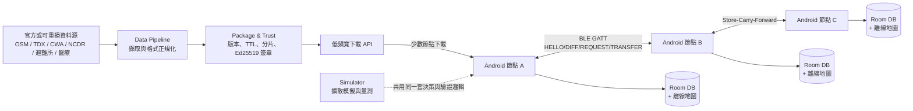

# ResilientGeo Mesh

> 極端通訊環境下的空間情報系統 — 當基地台總頻寬受限時，讓附近的手機彼此交換各自缺少的災情資料分片。

> 2026-09-06 更新：Android App 的 launcher 現在是 Flutter module 的內湖離線地圖；Android 原生保留 Room、事件驗證／TTL、BLE 與 transport harness，Flutter 透過 bridge 只讀取已驗證事件。

## 問題與目標

災害發生時通訊資源下降，但民眾與救援人員對「最新空間資訊」的需求反而急遽上升。現有地圖與防災服務多半依賴持續連網下載，因此會出現**有訊號、卻來不及取得關鍵資訊**的情況：地圖載不出來、關鍵資訊跟不重要的資訊一起搶頻寬、災前下載的離線地圖沒有災後新增的道路封閉與避難所滿載。

這不是假想情境。NCC 2025 Q1 統計行動通訊用戶約 2,879.5 萬、單季行動數據傳輸量 3,067.6 PB；2025 年丹娜絲颱風造成 1,293 座行動基地台受影響、12,296 戶市話中斷；2026 年城鎮韌性演習更首次納入大規模行動網路降速，14 個縣市、每次 30 分鐘，官方新聞稿記載將下載速率調降至 **256 KB** 等級。**降速、而不是斷網**，就是本專案設定的主要情境。

我們先盤點了既有解法，每一種都有明確的缺口：

| 現有方式 | 做法 | 缺點 |
| --- | --- | --- |
| 提前下載離線地圖 | 事前下載防災 App、避難地圖、截圖 | **只解決靜態資料**，災後新出現的道路封閉、避難所滿載完全不知道 |
| SMS / CBS 災防告警 | 簡訊或細胞廣播傳送警報 | 極省流量，但**單向、廣播式**，難做個人化路線與附近資源分析 |
| Wi-Fi / 固網 / 市話 | 行動網路慢時改用固定網路 | 必須**附近剛好有可用基礎設施**，不適合正在移動或身處災區的人 |
| 行動基地台 + 低軌衛星 | 災區部署基地台車、OneWeb、微波 | 很重要，但**設備、數量、人力有限**，無法立刻覆蓋所有民眾 |
| 災害漫遊 | 自家基地台損壞後改用其他業者網路 | 解決「沒訊號」，但**不代表頻寬充足**，另一家網路也可能塞爆 |

缺口很清楚：**沒有人處理「災後才發生、必須即時送到每個人手上的那一小塊動態資料」在總頻寬不足時要怎麼散播。** 因此本專題把範圍收斂到資訊的 mesh 交換。

核心洞察，也是本專案唯一想證明的事：

> 在 256 kbps（約 32 KB/s）的降速情境下，mesh **不可能比基地台快** — 我們實測 BLE GATT 只有 3.8–4.4 KB/s，比降速後的基地台還慢 5–10 倍。mesh 的價值不在速度，而在於**不要讓 100 個人從同一座基地台重複下載同一份資料**，把稀缺的總頻寬留給還沒拿到資料的人。

**目標使用者**：災害或演習期間身處降速區域的一般民眾，以及需要掌握現場動態的第一線人員。

**預期影響**：以內湖區 ~500 筆事件、50 節點的可重播模擬為例，加入 peer 交換後資料覆蓋率由 65% 提升到 100%，同時約 87–91% 的位元組不再向伺服器索取。

**定位**：這是既有行動網路、衛星、LoRa、基地台車之外的**額外韌性層**，不取代既有通訊，也不宣稱能創造額外的基地台頻寬。

## 核心功能

- **Flutter 離線優先的災情地圖** — 內湖道路 raster tiles、避難所、醫療院所與事件以版本化 asset／Room 提供；關掉網路、強制結束 App 再重開，地圖與已驗證事件照常顯示，並以 CURRENT／EXPIRED／UNVERIFIED 分色標示新鮮度與可信狀態。
- **Peer-to-peer 分片交換** — 兩台手機經 BLE GATT 完成 `HELLO`（交換資料集摘要）→ `DIFF`（算出雙方缺哪些分片）→ `REQUEST`（依 critical／稀有度／大小／TTL 排序）→ `TRANSFER`（分段、位元組級可中斷續傳）→ `VERIFY/APPLY`（驗證後原子寫入），**只交換對方缺少的分片**。
- **Store-Carry-Forward（DTN）** — A 傳給 B，B 移動後遇到 C 再傳給 C；A 與 C 從不需要同時連線。已用三台實機驗證：force-stop A 之後，C 仍經 B 收到並驗證全部事件。節點會把通過驗證的分片記進本機庫存，因此收到資料後能對下一個 peer 如實宣告「我有這些」，而不是回報空手。
- **端到端可信度** — 伺服器端以 Ed25519 簽章，手機端在寫入前驗證 hash、簽章、版本與 TTL。版本倒退一律拒絕；官方資料與群眾回報分屬不同 namespace，永不互相覆蓋。私鑰從不進入 repo，也不隨 App 出貨。
- **Emergency Mode** — 使用者手動開啟、有明顯狀態提示的前景服務。開啟後持續進行 BLE 廣播與掃描，在鎖屏、App 切到背景時仍維持運作，通知列即時顯示附近節點數。（**分片交換本身仍需由使用者在 Peer Sync 畫面發動**——兩台素未謀面的手機自動協商誰當 requester、誰當 server 尚未實作，見下方限制。）
- **可重現的量測工具** — 決定性 DTN 模擬器比較「無協作／一般 replication／rarest-first」三種策略 × 10/20/50/100 節點 × 地理過濾開關，產出 Coverage、Freshness、Cellular Savings、Transfer Efficiency 四項指標報告，固定 seed 可位元比對。

## 系統架構



**協作方式**：後端（`pipeline/`）是純 Node.js CLI，負責把多來源資料正規化成統一的 `event-v0` 格式，依 `(area_id, theme)` 分組切片、計算 canonical SHA-256 並以 Ed25519 簽章，輸出 manifest + chunks。**私鑰只存在伺服器端**。行動端（`android/`）在收到任何分片時，先由 `ChunkVerifier` 驗證 chunk hash 與簽章、再由 `EventVerifier` 逐筆驗證事件，最後才交給 `EventIngestor` 套用版本／TTL／namespace 規則寫入 Room；驗證不過的資料絕不進入 APPLY，也不覆蓋既有資料。傳輸層藏在 `PeerTransport` 介面後方（實作為 `BleGattTransport`），同步邏輯不綁死任何單一 Android API。模擬器（`simulator/`）刻意**共用手機端同一套 `computeDiff`／`buildRequest`／驗證邏輯**，只把傳輸層換成種子化的接觸模型，因此模擬結果與實機行為出自同一份決策程式碼。

沒有雲端資料庫、沒有外部服務相依。**App 沒有宣告 `INTERNET` 權限**——安裝後的 APK 只要求藍牙、前景服務與通知權限（可用 `aapt2 dump permissions` 驗證），peer 交換只需要藍牙。ADR-001 否決的 Nearby Connections 與 Wi-Fi Direct 實作已連同它們所需的 Wi-Fi／Play Services 權限一併移除，只保留在 git 歷史與 ADR 記錄中。

## 使用技術

| 類型 | 技術／服務 | 用途 |
| --- | --- | --- |
| AI 模型 | 未使用 | 本專案為協定與傳輸層研究，不涉及模型推論；所有排程決策（critical-first、rarest-first、地理過濾）皆為決定性規則，以利可重現量測 |
| 前端（行動端） | Kotlin Android host（minSdk 26／targetSdk 37）+ Flutter module | Flutter launcher、Room／BLE bridge、Emergency Mode 權限與原生服務 |
| 前端（地圖） | Flutter `flutter_map` + `latlong2` + `AssetTileProvider` | 內湖區版本化 raster tiles、道路、避難所、醫療院所與事件圖層，無線上 tile fallback |
| 後端（資料管線） | Node.js（零外部相依，僅用內建模組）、`node:crypto` Ed25519 | 來源擷取、正規化、分片、簽章與驗證 CLI |
| 後端（模擬與分析） | Node.js 決定性模擬器、`node:test` | DTN 擴散模擬、四指標報告、位元級可重現性檢查 |
| 資料庫 | Room 2.6.1 / SQLite（KSP 註解處理） | 手機本機事件、版本、到期時間儲存 |
| 密碼學 | Bouncy Castle `bcprov-jdk18on` 1.78.1 | Android 端 Ed25519 驗簽（平台 provider 至 API 33 才支援 EdDSA） |
| 傳輸層 | Android BLE GATT（自訂 service：DATA write／ACK notify／CONTROL characteristic） | Peer discovery、連線、分片傳輸與位元組級續傳 |
| 資料契約 | JSON Schema（`event-v0`／`manifest-v0`／`chunk-v0`／`peer-summary-v0`／`feature-v0`） | 跨模組介面，pipeline 與 Android 各自實作、以同一份 fixture 交叉驗證 |
| 測試 | Flutter test、JUnit 4、AndroidX Test、`node:test`、Python `unittest` | 19 項 Flutter 測試、48 項 JVM 單元測試、14 項 instrumented 測試、122 項 Node 測試、6 項 Python 測試 |
| Sponsor 技術 | 未使用 | 本次未使用主辦方或贊助商提供的服務；pipeline 與 simulator 零第三方相依，Android 端僅用 AndroidX 與 Bouncy Castle |

> 曾評估但**否決**的技術，實測記錄見 [`docs/adr/ADR-001-transport-layer.md`](docs/adr/ADR-001-transport-layer.md)：**Nearby Connections**（兩台實機皆回傳 Google 側 `INTERNAL_ERROR`，非 App 端可控）、**原生 Wi-Fi Direct**（discovery／連線可行，但 TCP 卡在疑似 Android per-app 網路路由限制）。

## 安裝與執行

### 需求

- Node.js 20+（pipeline 與 simulator，無需 `npm install`，零外部相依）
- Python 3.10+（replay 測試，僅用標準庫）
- Flutter 3.29.2／Dart 3.7.2（內湖地圖 module）
- JDK 17+ 與 Android SDK（Android App；Android Studio 內建的 JBR 即可）

```bash
git clone https://github.com/Jiruiii/OSS.git
cd OSS

# ---------- 1. 驗證整套資料契約與模擬器（不需要手機，約 1 分鐘） ----------
npm test                                   # 122 項通過（pipeline + simulator）
python -m unittest discover -s tests -v    # 4 項通過（replay fixture）

# ---------- 2. 產生並驗證一份真實簽章的資料封包 ----------
node pipeline/cli.mjs keygen --out-dir .stage2-keys --key-id neihu-demo-2026
node pipeline/cli.mjs build \
  --input data/fixtures/neihu/demo-v136.json \
  --out-dir .neihu-bundle \
  --private-key .stage2-keys/private-key.pem \
  --key-id neihu-demo-2026
node pipeline/cli.mjs verify \
  --manifest .neihu-bundle/manifest.json \
  --chunks-dir .neihu-bundle/chunks \
  --public-key .stage2-keys/public-key.pem \
  --now 2026-09-01T08:00:00Z

# ---------- 3. 重現實驗報告（三種策略的差異） ----------
node simulator/cli.mjs run --nodes 50 --strategy no-coop      --seed 20260904 --out .sim-out
node simulator/cli.mjs run --nodes 50 --strategy rarest-first --seed 20260904 --out .sim-out
node simulator/cli.mjs run --nodes 50 --strategy rarest-first --seed 20260904 --geo-filter --out .sim-out
node simulator/cli.mjs matrix --check      # 位元比對已提交的 experiments/results/，應為 PASS

# ---------- 4. Flutter 內湖地圖 ----------
cd flutter
flutter pub get
flutter analyze
flutter test                                 # 19 項通過

# ---------- 5. Android App（需實機或模擬器） ----------
# 先建立 android/local.properties，內容為 sdk.dir=<Android SDK 路徑>
cd android
./gradlew testDebugUnitTest                # 48 項 JVM 單元測試
./gradlew connectedDebugAndroidTest        # 14 項 instrumented 測試（需接實機）
./gradlew assembleDebug                    # 產生含 Flutter 地圖的 debug APK
./gradlew installDebug                     # 安裝到已連線的裝置
```

App 主畫面直接進入 Flutter 內湖離線地圖，提供道路底圖、避難所／醫療院所／事件圖層、圖層設定、回到內湖範圍、點位詳情與重疊點位選擇；「載入內建 fixture」與 Emergency Mode 仍由 Android bridge 執行。Peer Sync、BLE spike 與量測畫面是 debug-only 的原生測試 harness，不放在一般地圖主畫面。

**兩機 peer sync 實測**需要兩台開啟藍牙的 Android 裝置，debug APK 可由 Android Studio 啟動對應的 `PeerSyncMilestoneActivity`，再分別指定 NODE_A（requester）／NODE_B（server）角色。逐步 demo 講稿見 [`experiments/demo.md`](experiments/demo.md)；Android 端建置細節與踩雷紀錄見 [`android/README.md`](android/README.md)。

### 實測與模擬結果摘要

實機（Pixel 7 / Pixel 8a / Sharp SH-M32）：

| 項目 | 結果 |
| --- | --- |
| BLE GATT 吞吐量 | 3.8–4.4 KB/s（10s／30s／60s 接觸窗多輪量測） |
| 斷點續傳 | 位元組級續傳成功（中斷點回報的 `bytesTransferred` 直接作為下次 `resume()` 的 offset） |
| 跨品牌相容性 | Google Pixel（API 37）+ SHARP（API 35），滿足「兩品牌、兩 Android 版本」 |
| 三機 Store-Carry-Forward | A 完全 force-stop 後，C 仍經 B 收到並驗證全部 4 筆簽章事件（含一個中斷又續傳的 chunk） |
| 不重複下載（核心主張） | 第二次相遇時 `DIFF: missing=[]`，「already in sync」——節點從本機庫存如實宣告持有，一個 byte 都不重傳 |
| 連線成功率 | 亮屏 17/20（85%，p50 289ms）；**鎖屏 0/19（0%）** — 這正是 Emergency Mode 需要前景服務的直接證據 |
| 耗電 | baseline 385 mW → Emergency Mode 439 mW（**+54 mW，+14%**，螢幕關閉、6 輪交錯各 60 筆）；約等於每小時多耗 0.3% 電量 |

模擬（內湖五個生活圈、約 500 筆事件、24 回合 × 30 秒，以 50 節點為例）：

| 策略 | Coverage (final) | Cellular Savings | Freshness p50 |
| --- | ---: | ---: | ---: |
| `no-coop`（各自下載） | 65.1% | 0% | 360s |
| `replication`（一般 P2P） | 100% | 87.1% | 150s |
| `rarest-first` | 100% | 86.6% | 150s |
| `rarest-first` + 地理過濾 | 100%（relevant） | **91.3%** | **120s** |

完整 24 格矩陣、ASCII 曲線與每個區塊的樣本數見 [`experiments/results/report.md`](experiments/results/report.md)。

## 作品展示

- 作品展示網址（選填）：<!-- TODO：若有線上 demo 或 APK 下載連結請填入 -->
- 評選影片：<!-- TODO：請填入影片連結 -->

## 限制與未來工作

如實揭露，不是藉口：

**已知限制**

- **資料是可重播的模擬資料，不是即時官方 API。** 幾何取自真實 OSM 快照，災情事件為合成，不代表任何真實災況。TDX／CWA／NCDR 的 collector 已實作並通過官方 OAS 驗證，但未接上正式金鑰。
- **不宣稱在任何固定時間覆蓋全城。** 所有模擬數字只適用於 [`experiments/scenario.md`](experiments/scenario.md) 描述的內湖情境與接觸模型，單一 seed，非多次抽樣的信賴區間。
- **模擬參數只校準了一半。** `max_bytes_per_round` 已用實機 BLE 接觸窗量測校準；`contact_probability`（社交接觸機率）與 `transfer_failure_prob` 仍是工程估計值 — 現有實機數據沒有一項直接對應到這兩個參數，硬套上去會是假精確。
- **耗電只有單一機型、單一 60 秒視窗、只涵蓋持續傳輸**，不是 Emergency Mode 真實的間歇性接觸型態，也未涵蓋鎖屏情境。
- **Emergency Mode 只做到「發現」，還沒做到「自動同步」。** 服務會持續 BLE 廣播與掃描並回報附近節點數，但不會自行建立 GATT 連線跑 HELLO/DIFF/REQUEST——兩台素未謀面的手機要自動協商誰當 requester、誰當 server，這件事尚未實作，分片交換仍需使用者在 Peer Sync 畫面發動。
- **鎖屏／背景存活尚未用正式前景服務重跑**（先前一次嘗試因螢幕被意外喚醒而無效），跨機型的 20 次連線成功率統計也尚未補齊。
- **耗電只涵蓋「持續發現」，不含傳輸。** 目前服務不會自行建立 GATT 連線交換分片，所以 +54 mW 是待命成本，實際同步時的耗電尚未量測；且只有 1 台機型、鄰居數固定為 1。（同日稍早那組 22.35→26.78 mW 已作廢——當時手機插著 USB 且滿電，量到的是計量器雜訊，詳見 `experiments/results/energy-raw/README.md`。）
- **Peer 摘要只有 requester 端是動態的。** 節點現在會把驗證通過的分片記進本機庫存並據此組出 HELLO，但 demo 中的 server 端仍從 `assets/` 供應分片內容——本機庫存刻意不存分片本體（事件已寫進資料庫，再存一份是重複），所以「我驗證過這片」與「我能重新供應這片的位元組」目前仍是兩件事。

- **固定大小切分讓版本更新無法真正 delta**：`fixed-size` 切分下，資料集只要有一筆事件變動，同組後面所有 chunk 的邊界就會位移、hash 全變。
- **HELLO 表示法會隨資料集線性膨脹**：目前逐條列舉 chunk（183 chunk 約 36 KB）；全台規模會膨脹到數百 KB，在一次接觸窗內傳不完。

**未來工作**

- 接上 TDX／CWA／NCDR 正式金鑰，將可重播 fixture 換成即時官方資料。
- 以 **Bloom filter 或對 manifest 順序的 bitmap** 取代逐條列舉的 HELLO（同樣 183 chunk 只要 23 bytes，省約 1,500 倍），讓資料集可擴展到全台規模。
- 導入**內容導向切分（CDC / rolling hash）或組內單事件對齊**，讓版本更新能真正 delta 傳輸而非整組重傳。
- 補齊跨機型連線成功率統計、鎖屏／Doze 長時存活驗證，以及間歇性接觸模式下的耗電量測。
- 讓 Emergency Mode 服務自行完成連線與同步（含兩台裝置相遇時的自動角色協商），把「開著就會自己交換」變成真的。
- 讓節點能重新供應自己持有的分片位元組，而不只是宣告持有；群眾回報的信譽評分與多裝置共識。
- 擴大目前版本化 raster tiles 的覆蓋範圍，並加入離線路徑規劃。

完整版見 [`experiments/limitations.md`](experiments/limitations.md) 與 [`docs/mvp-remaining-tasks.md`](docs/mvp-remaining-tasks.md)。

## 第三方服務、資料與素材

repo 內不含任何 API 金鑰、Token 或個人資料。金鑰僅由本機 gitignored 的 `pipeline/.env` 提供（範本見 `pipeline/.env.example`），且從不寫入 Raw snapshot、fixture、log 或 Android bundle。Ed25519 私鑰只在伺服器端 CLI 執行當下存在，從未提交進 repo。

**資料來源**

| 來源 | 連結 | 授權 | 用途與現況 |
| --- | --- | --- | --- |
| OpenStreetMap（Overpass API） | <https://overpass-api.de/api/interpreter> | ODbL，需標示 attribution（© OpenStreetMap contributors） | 內湖區道路與 POI 幾何，已擷取為版本化快照 `data/fixtures/neihu/osm-snapshot.json` |
| 臺北市區界圖 | <https://data.taipei/dataset/detail?id=1601ef3a-c253-4988-b047-943d9e786143> | 臺北市資料開放授權 | 官方內湖行政區邊界，作為跨來源空間過濾基準 |
| TDX 運輸資料流通服務 — 道路事件 | <https://tdx.transportdata.tw/api-service/swagger/basic/60abfa19-ffe3-4eef-a4b1-0539435dfca9> | TDX 服務條款與資料授權 | Collector 已實作（OAuth2 client credentials），**未接正式金鑰**，目前使用 response-shaped 本機 fixture |
| 中央氣象署 CWA — 顯著有感地震 | <https://opendata.cwa.gov.tw/dataset/earthquake/E-A0015-001> | CWA 氣象開放資料平臺服務條款 | 同上，Collector 已實作、未接金鑰 |
| 中央氣象署 CWA — 天氣警特報 | <https://opendata.cwa.gov.tw/dataset/warning/W-C0033-001> | CWA 氣象開放資料平臺服務條款 | 同上；縣市級警報標記 `coverage_level=city`，不宣稱內湖區精度 |
| NCDR 災害示警 | <https://datahub.ncdr.nat.gov.tw/paradigm> | NCDR 平臺條款或來源機關授權 | Collector 已實作，帳號未開通，標記 `blocked_by_access`，Demo 使用可重播 fallback |
| 消防署避難收容處所點位檔 | <https://data.gov.tw/dataset/73242> | 政府資料開放授權條款第 1 版 | 內湖區避難所點位、容量與適用災害類別 |
| 臺北市公私立醫療院所 | <https://data.taipei/dataset/detail?id=ffdd5753-30db-4c38-b65f-b77892773d60> | 臺北市資料開放授權 | 內湖區醫院點位 |
| NCC 鄉鎮區基地臺統計 | <https://data.gov.tw/dataset/41256> | 政府資料開放授權條款第 1 版 | 基礎設施密度 proxy（P2，尚未整合） |
| 內政部 20m DTM / 100m DEM·DSM | <https://data.gov.tw/dataset/176927> | 政府資料開放授權條款第 1 版 | 僅登錄 metadata，尚未整合 |
| Copernicus Data Space（STAC） | <https://documentation.dataspace.copernicus.eu/APIs/STAC.html> | Copernicus Data Space Ecosystem 資料條款 | 僅登錄 metadata，尚未整合 |

> **重要聲明**：`data/fixtures/neihu/` 內的災情事件（哪條路封閉、哪個避難所開設、哪段邊坡警戒）皆為**合成模擬資料**，建立在真實 OSM 地物幾何之上，**不代表任何真實災況，也不得呈現為即時官方警報**。完整來源盤點與線上驗證記錄見 [`docs/neihu-online-data-sources.md`](docs/neihu-online-data-sources.md) 與機器可讀的 [`pipeline/sources/catalog.json`](pipeline/sources/catalog.json)。

**軟體相依**

| 套件 | 授權 | 用途 |
| --- | --- | --- |
| AndroidX（core-ktx、appcompat、recyclerview、lifecycle、room、test） | Apache-2.0 | Android 基礎元件與本機資料庫 |
| Material Components for Android | Apache-2.0 | UI 元件與主題 |
| Bouncy Castle `bcprov-jdk18on` | Bouncy Castle License（MIT 風格） | Ed25519 驗簽 |
| `org.json` | Public Domain | JVM 單元測試中的 JSON 解析（Android 內建版為 stub） |
| kotlinx.coroutines | Apache-2.0 | 非同步傳輸流程 |
| Google Play Services Nearby | Google APIs 服務條款 | ADR-001 評估用，**已否決**，程式碼保留作為決策佐證 |
| JUnit 4 | EPL-1.0 | 單元測試 |

pipeline 與 simulator **不使用任何第三方 npm 套件**，僅使用 Node.js 內建模組；Python 測試僅使用標準庫。專案內未使用任何第三方圖片、字型或音效素材；Android 啟動圖示由 Android Studio 產生的向量圖形組成。

## 團隊成員

| 姓名 | 分工 |
| --- | --- |
| <!-- TODO: 姓名 --> ([@Jiruiii](https://github.com/Jiruiii)) | 實機整合與量測：把 Peer Sync 協定接上 `BleGattTransport`、兩機／三機實機測試、前景服務背景與鎖屏驗證、接觸窗吞吐量與耗電量測 |
| <!-- TODO: 姓名 --> ([@CC10206](https://github.com/CC10206)) | 協定邏輯與量測分析：Kotlin 版 `computeDiff`／`buildRequest` 與 JVM 單元測試、Emergency Mode UI 與前景服務骨架、simulator 校準、實驗報告與文件維護 |
| <!-- TODO: 姓名 --> (wangchingchuen) | 資料管線與資料來源：多來源 collector、正規化、`(area_id, theme)` 地理分片、Ed25519 簽章與驗證、內湖資料集生成 |

> 分工依據為 [`team-assignments.md`](team-assignments.md)（含各里程碑的完成證據與交接點）。上表的 GitHub 帳號取自 commit 紀錄，**請團隊補上對應真實姓名後再送出**。

## License

**Apache License 2.0** — 完整條文見儲存庫根目錄的 [`LICENSE`](LICENSE)。

> 注意：程式碼授權與**資料授權相互獨立**。本專案的 OSM 衍生資料（`data/fixtures/neihu/osm-snapshot.json` 及其衍生 fixture）受 **ODbL** 規範，散布時須保留 OpenStreetMap attribution；政府開放資料則依各自來源的授權條款（見上方「第三方服務、資料與素材」）。

---

### 延伸文件

| 文件 | 內容 |
| --- | --- |
| [`system.md`](system.md) | 系統實作計畫、開發階段與驗收條件、風險與停止條件 |
| [`docs/data-contract-v0.md`](docs/data-contract-v0.md) | Event／Feature／Chunk 的欄位、身分、版本與簽章規則 |
| [`docs/peer-sync-v0.md`](docs/peer-sync-v0.md) | HELLO → DIFF → REQUEST 協定與跨版本 DTN 規則 |
| [`docs/adr/ADR-001-transport-layer.md`](docs/adr/ADR-001-transport-layer.md) | 傳輸層選型：三個候選的完整實機記錄與否決理由 |
| [`docs/mvp-remaining-tasks.md`](docs/mvp-remaining-tasks.md) | MVP 剩餘待辦與完成標準 |
| [`android/README.md`](android/README.md) | Android 專案結構、建置踩雷紀錄與設計決策 |
| [`experiments/README.md`](experiments/README.md) | 實驗產物、重新產生方式與主要結論 |
| [`C_BLEbroadcast.md`](C_BLEbroadcast.md) | BLE 實機測試的原始工作筆記 |
