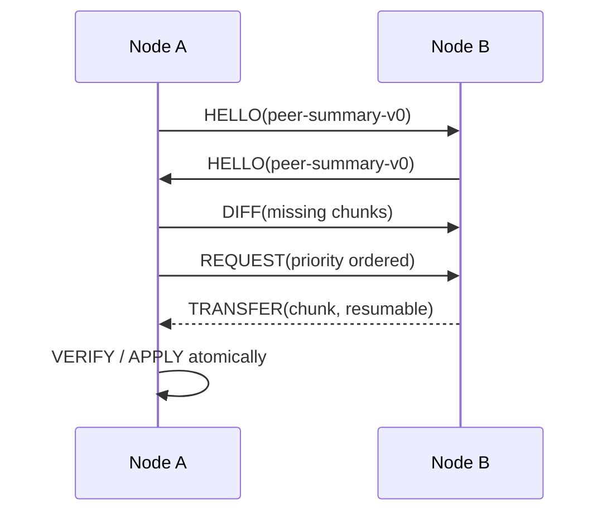

# Peer Sync v0：HELLO → DIFF → REQUEST

v0 將傳輸層藏在協定之下。BLE、Nearby Connections 或 Wi-Fi Direct 只負責提供連線與 byte stream；同步狀態機只處理下列訊息。

## 訊息流程

固定 fixture 位於 `fixtures/protocol-exchange-v0.json`。Node A 已有 `dahu:road` 與 `xihu:flood` 分片，Node B 另外持有 `resilientgeo-demo:chunk:136:dahu:shelter:000`，所以 A 只請求這一片。

## v0 欄位規則

- `HELLO` 交換 `peer-summary-v0`，只作為 inventory hint，不代表資料已可信。
- `DIFF` 必須帶 `dataset_id`、`namespace` 與 `manifest_id`，避免不同資料集的 chunk id 意外混用。
- `REQUEST` 的 chunk 順序先依 `priority`（CRITICAL、HIGH、NORMAL、LOW），同優先序再依大小與 TTL；v0 fixture 只有一片，後續排程器再補完整 tie-breaker。
- `offset_bytes` 與 `resume` 支援斷線續傳；續傳完成後仍需重新計算完整 chunk hash。
- `TRANSFER` 未列入本時段的固定 exchange，下一步才加入分段 framing、checksum、超時與 Peer 上限測試。
- 任何驗證失敗都不得進入 APPLY；失敗結果要記錄原因，但不覆蓋原有資料。

## bbox 相關性過濾（資料層已支援，排程器屬階段 3）

每個 chunk 與 manifest 條目都帶 `area_id` 與 `bbox`（`[minLon, minLat, maxLon, maxLat]`）。節點在 `DIFF` 之後、`REQUEST` 之前可以先做地理過濾：

- 只 `REQUEST` 與**自身所在 area 或鄰接 area** 相交的分片——住西湖的節點不必下載大湖山莊的土石流分片。
- 判斷方式：拿 manifest 條目的 `bbox` 與節點自身的關注範圍（目前 area、路線、或手動框選）做矩形相交測試，不需先取得 chunk 內容。
- `CRITICAL` 分片可設定為忽略地理過濾一律接收（例如全區級洪水警報），由 `priority` 決定。

這一節只定義**資料層規則**；實際的鄰接圖、關注範圍設定與 `REQUEST` 排程器（rarest-first、critical-first、TTL tie-break）是階段 3 的工作，`system.md` 第 6 節階段 3。本 branch 只確保 manifest 不下載 chunk 就足以做這個決定。

## 跨 `manifest_id` 的 DIFF 行為（2026-09-05 決定）

### 問題

原本 `computeDiff` 在 `local.manifest_id !== remote.manifest_id` 時直接 `throw`。這隱含「所有節點對同一份 manifest 交換分片」——那是 BitTorrent swarm 模型（大家下載同一個檔案的不同片）。但題目要的是 DTN 模型：A 帶著 v137 走進一個大家還停在 v136 的避難所。**這正是最有價值的一次相遇**，舊版協定會直接拒絕它。

### 決定：dataset_version 較新者勝出，整份 dataset 一起處理

`computeDiff`（`pipeline/lib/peer-sync.mjs`）現在區分兩種情況：

1. **`manifest_id` 相同**：沿用原本逐 chunk 比對（`chunk_hash` 不同視為 stale）。
2. **`manifest_id` 不同**：
   - 兩邊 `dataset_version` 相同但 `manifest_id` 不同 → 視為異常（兩份手稿宣稱同一版號），仍然 `throw`，不當作正常同步路徑。
   - `remote.dataset_version < local.dataset_version` → remote 對這個 dataset 沒有新東西，回傳空的 `missing_chunks`／`stale_chunks`。
   - `remote.dataset_version > local.dataset_version` → 視為 DTN supersession：**整個 remote 的 chunk 列表**（扣掉跟 local 任何 chunk `chunk_hash` 完全相同的極少數巧合）都算 `missing_chunks`，`diff.manifest_id` 換成 remote 較新的 manifest_id，並帶上 `superseded_manifest_id = local.manifest_id`。`buildRequest()` 把 `superseded_manifest_id` 原封傳到 REQUEST，讓 APPLY 端知道同步完成後要把舊 manifest_id 從這個 dataset 上除役，而不是兩份並存。

這**不是**逐 chunk 比對新舊 manifest（沒有「哪幾片沒變、只傳變動的片」這件事）——理由見下一節。

### 為什麼不做逐 chunk／逐 event diff（v0 暫不實作，記錄為 v0.1 方向）

v0 曾考慮兩個更精細的替代方案，決定先不做：

- **以 `(namespace, event_id, event_version)` 為單位比對**：精確，但需要 HELLO 攜帶事件層級的粒度，跟 C3（見下）刻意把 HELLO 壓縮到 chunk 層級摘要互相衝突——要嘛 HELLO 變大，要嘛另外開一輪握手才能拿到 event 列表，兩者都超出 v0 的時間預算。
- **逐 chunk diff，只傳真正變動的 chunk**：理論上可行，但要求「未變動的 chunk 在版本間 hash 保持穩定」，而目前 `manifest.chunking.algorithm: 'fixed-size'`（`pipeline/lib/bundle.mjs`）做不到這件事（見下）。

### C2 延伸：固定大小切分讓版本更新無法 delta（設計決定，尚未實作）

`bundle.mjs` 的 `groupEvents()` 先按 `(area_id, theme)` 分組是對的方向（把爆炸半徑限制在同一個 area/theme），但組內仍是 byte-size 累積切分：組內任一筆事件變動，會讓該組後面所有 chunk 的邊界位移、hash 全變，**整份要重傳**，對 delta sync 是致命的。

決定：v0 維持現有 byte-size 切分（改動風險與時間成本超出目前預算，且 v0 的資料集規模——內湖 500 筆——重傳整組的代價還可接受），但記錄下 v0.1 的兩個候選方向，供階段 3 排入之前先評估：

- **內容導向切分（CDC / rolling hash）**：邊界由內容決定，插入/刪除只影響鄰近邊界，業界標準做法（rsync、restic 等），但需要重寫 `groupEvents()` 的切分邏輯並重新驗證所有下游（chunk_id 格式、manifest 排程、Android 端解析）。
- **組內穩定排序 + 單事件對齊**：不看 byte size，一片固定 N 筆事件、依 `event_id` 穩定排序，插入事件只影響它自己所在的那一片之後的片（仍會位移，但比目前的「隨機累積」更可預期，實作成本遠低於 CDC）。

這兩個方向都要等 C1 的「一次接觸能傳多少 bytes」量測（`docs/adr/ADR-001-transport-layer.md`）出來後，才能決定 `targetSizeBytes` 該多大——是同一個設計決策，不該分開做。

## HELLO 表示法（C3，已知擴展路徑，v0 不實作）

`schemas/peer-summary-v0.schema.json` 目前逐條列出每個 chunk 的 `chunk_id`／`chunk_hash`／`size_bytes`／`priority`／`state`（實測單條 202 bytes）。內湖 500 筆（183 chunk）算下來 HELLO 是 36 KB，BLE @ 4 KB/s 約 9 秒，在 30 秒接觸窗裡還能接受；但資料集一旦擴到全台規模（數千 chunk），HELLO 會膨脹到數百 KB，在一次接觸窗內傳不完，而且會隨資料集線性膨脹。

標準做法是 **Bloom filter** 或**對 manifest 順序的 bitmap**（有／沒有各 1 bit：183 chunk 只要 23 bytes，比逐條列舉省約 1500 倍）。v0 不實作，但先寫下來：等資料集規模逼近全台範圍、需要換 HELLO 格式時，`peer-summary-v0.schema.json` 可能已經被 pipeline、Android trust adapter、排程器三個模組依賴，屆時改格式的成本會高一個數量級——現在先知道終點在哪，之後才不會把 schema 焊死。
