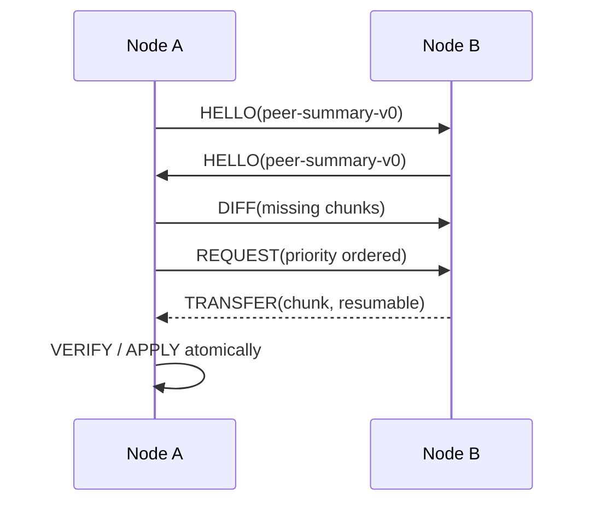

# Peer Sync v0：HELLO → DIFF → REQUEST

v0 將傳輸層藏在協定之下。BLE、Nearby Connections 或 Wi-Fi Direct 只負責提供連線與 byte stream；同步狀態機只處理下列訊息。

## 訊息流程

固定 fixture 位於 `fixtures/protocol-exchange-v0.json`。Node A 已有 `dahu:road` 與 `xihu:flood` 分片，Node B 另外持有 `resilientgeo-demo:chunk:136:dahu:shelter:000`，所以 A 只請求這一片。

## v0 欄位規則

- `HELLO` 交換 `peer-summary-v0`，只作為 inventory hint，不代表資料已可信。
- `DIFF` 必須帶 `dataset_id`、`namespace` 與 `manifest_id`，避免不同資料集的 chunk id 意外混用。
- `REQUEST` 的 chunk 順序先依 `priority`（CRITICAL、HIGH、NORMAL、LOW），同優先序再依大小與 TTL；v0 fixture 只有一片，後續排程器再補完整 tie-breaker。
- `offset_bytes` 與 `resume` 支援斷線續傳；續傳完成後仍需重新計算完整 chunk hash。
- `TRANSFER` 未列入本時段的固定 exchange，下一步才加入分段 framing、checksum、超時與 Peer 上限測試。
- 任何驗證失敗都不得進入 APPLY；失敗結果要記錄原因，但不覆蓋原有資料。

## bbox 相關性過濾（資料層已支援，排程器屬階段 3）

每個 chunk 與 manifest 條目都帶 `area_id` 與 `bbox`（`[minLon, minLat, maxLon, maxLat]`）。節點在 `DIFF` 之後、`REQUEST` 之前可以先做地理過濾：

- 只 `REQUEST` 與**自身所在 area 或鄰接 area** 相交的分片——住西湖的節點不必下載大湖山莊的土石流分片。
- 判斷方式：拿 manifest 條目的 `bbox` 與節點自身的關注範圍（目前 area、路線、或手動框選）做矩形相交測試，不需先取得 chunk 內容。
- `CRITICAL` 分片可設定為忽略地理過濾一律接收（例如全區級洪水警報），由 `priority` 決定。

這一節只定義**資料層規則**；實際的鄰接圖、關注範圍設定與 `REQUEST` 排程器（rarest-first、critical-first、TTL tie-break）是階段 3 的工作，`system.md` 第 6 節階段 3。本 branch 只確保 manifest 不下載 chunk 就足以做這個決定。
