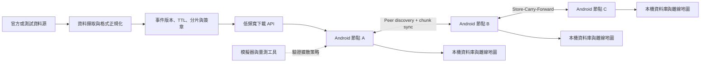

# ResilientGeo Mesh — 系統實作計畫

> 進度更新（2026-09-04）：v0 資料契約與本機可信資料管線已完成；Demo 場域定為**台北市內湖區**，已導入真實 OSM 地理的可重播資料集與 `(area_id, theme)` 地理分片。下一步先完成「階段 0」的 Android 實機傳輸 Spike，再進入單機 App。資料源仍是可重播快照（OSM snapshot ＋ TDX-shaped 輸入），不是即時 API 資料。

## 目前進度總覽

| 工作項目 | 狀態 | 已完成／尚缺 |
| --- | --- | --- |
| Event、Manifest、Chunk、Peer Summary v0 | 已完成 | `schemas/` 四份 JSON Schema 與 phase-0 fixture 已建立 |
| Phase-0 replay 與測試資料集 | 已完成 | 可重播新增、更新、過期、namespace 隔離與版本倒退；內湖 curated（~27）與 scale（~500）資料集已生成 |
| 階段 2：資料正規化 | 已完成 | `pipeline/lib/normalize.mjs` 可將 TDX-shaped input 轉為 unsigned Event v0 |
| 階段 2：hash、Ed25519、Manifest、Chunk | 已完成 | `pipeline/` 可簽署與驗證完整 bundle，私鑰只由 server-side CLI 使用 |
| 階段 2：安全測試 | 已完成 | Node 測試涵蓋竄改、版本 replay、TTL、incomplete chunk |
| 真實資料源 | 尚未開始 | 目前沒有呼叫 TDX／CWA／NCDR 即時 API |
| Android 驗證器與 App | 尚未開始 | 目前是 platform-neutral Node verifier，尚無 Android project、離線 DB 或地圖 UI |
| Android 實機傳輸 Spike | 已完成 | 兩台實機（Pixel 7 + Pixel 8a）比較 Nearby Connections（已否決，Google 側 INTERNAL_ERROR）、Wi-Fi Direct（已否決，TCP 傳輸層卡住）、BLE GATT（採用，discovery/連線/傳輸/斷點續傳皆驗證通過）。ADR-001 已定案，見 `docs/adr/ADR-001-transport-layer.md` |
| Simulator／實驗報告 | 尚未開始 | 尚未建立 10／20／50／100 節點情境與耗電、延遲、流量報告 |

狀態證據：`npm test` 的 Node 測試 20 項全數通過（含地理分片、bbox 竄改偵測、生成器決定性），`python -m unittest discover -s tests -v` 的 Python 測試 4 項通過；CLI 也已完成 keygen → build → verify 端到端測試（`demo-v136` 產生 22 個帶 area／theme 的已驗證分片）。正式 Android 驗簽、實機傳輸與真實來源接入仍不能視為完成。

> 2026-09-05 修正：先前記錄的「16 項通過」是舊數字，且當時 Windows checkout 出來的 `fixtures/neihu/*.json` 因 `core.autocrlf=true` 又沒有 `.gitattributes` 而帶 CRLF，跟決定性生成器輸出的 LF 逐位元組比對必然 MISMATCH——這是假失敗，不是生成器不決定性。已新增根目錄 `.gitattributes`（`*.json`／`*.mjs`／`*.md` 固定 `eol=lf`）並重新 checkout 正規化，`npm test` 現在 20 項全過。

## 1. 專案目標

在行動網路低頻寬或局部斷線時，讓 Android 手機仍能：

1. **避免同一份資料被每個人各自從基地台重複下載**——把稀缺的總頻寬留給還沒拿到資料的人，與附近手機交換缺少的更新分片。
2. 查看預先下載的離線地圖。
3. 接收少量、可驗證的災情增量更新。
4. 辨識資料來源、版本、時效與可信狀態。
5. 量測資料擴散速度、節省的行動流量與耗電量。

系統定位是「既有行動網路、衛星、LoRa、基地台車之外的額外韌性層」，不是取代既有通訊，也不宣稱能創造額外的基地台頻寬。

> 2026-09-05 調整：原本第一順位是「查看離線地圖」，把 mesh 同步排在第 3 點且措辭是手段（交換分片）而非價值（減少重複下載）。但題目模擬的是「有訊號但被降到 256 kbps（≈32 KB/s）」，不是完全斷網——在這個情境下 mesh 的價值不是比基地台快（BLE 實測 3–6 KB/s，反而比 256 kbps 慢 5–10 倍），而是題目本身第五點強調的「不要讓 100 個人從基地台重複下載同一份資料」。目標順位改成這個，demo 敘事也應該對應改成「10 台共用 256 kbps、一台下載、九台從 peer 拿到」，而不是「兩台飛航模式互傳」。

## 2. MVP 邊界

### MVP 必須完成

- **平台**：Android First，使用者手動開啟有明顯狀態提示的 Emergency Mode。
- **地圖**：一個測試區域的離線底圖與道路、避難所圖層。
- **資料**：先接一個官方或可重播的測試資料源，轉為統一事件格式。
- **同步**：2–5 台 Android 裝置能發現彼此，只交換缺少的事件分片。
- **可信度**：裝置在寫入資料前驗證雜湊、簽章、版本與 TTL。

### MVP 暫不處理

- iOS 背景 Relay 與 24 小時自動掃描。
- 全台所有 CWA、TDX、NCDR、消防署資料源一次整合。
- 群眾回報的信譽評分與多裝置共識。
- Fountain Code、Erasure Coding 與城市級自動分群。
- 災時正式上線、政府系統整合或安全認證。

## 3. 建議系統架構



### 五個模組

| 模組 | 責任 | MVP 產物 |
| --- | --- | --- |
| Data Pipeline | 擷取、正規化與版本化空間事件 | 可重播的 JSON/Protobuf 測試資料集 |
| Package & Trust | 建立 manifest、chunk、hash、signature、TTL | 能簽署與驗證的資料封包 |
| Android GIS | 儲存離線底圖與事件，顯示新鮮度 | 測試區域地圖與事件圖層 |
| Peer Sync | 發現 Peer、比較版本、交換缺少分片 | 2–5 台實機同步 Demo |
| Experiment Harness | 模擬密度、移動與網路條件 | Coverage、延遲、流量與耗電報告 |

## 4. 核心資料模型

第一版事件至少包含：

```json
{
  "event_id": "tdx:road:382",
  "event_type": "ROAD_CLOSED",
  "geometry": {},
  "severity": "HIGH",
  "source": "TDX",
  "source_version": "135",
  "issued_at": "2026-09-01T06:32:00Z",
  "expires_at": "2026-09-01T08:32:00Z",
  "payload_hash": "sha256:...",
  "signature": "base64:..."
}
```

資料套用規則：

1. 簽章或雜湊驗證失敗：拒絕寫入。
2. 同一 `event_id`：較新且可驗證的版本覆蓋舊版本。
3. 超過 `expires_at`：保留快取但標為過期，不當作目前狀態。
4. 官方資料與群眾回報使用不同 namespace，不能互相覆蓋。
5. 原始來源、接收時間與傳輸來源分開記錄，便於稽核。

## 5. Peer Sync 最小協定

一次連線只做五件事：

1. `HELLO`：交換節點能力、資料集版本與 manifest 摘要。
2. `DIFF`：計算雙方缺少或過期的 chunk。
3. `REQUEST`：依 critical、稀有度、大小與 TTL 排定下載順序。
4. `TRANSFER`：分段傳送，可中斷續傳；同時限制 Peer 數量。
5. `VERIFY/APPLY`：驗證 hash 與 signature 後，以原子方式寫入本機。

傳輸層必須藏在介面後方。階段 0 先用實機 Spike 比較 Nearby Connections 與原生 Wi-Fi Direct／BLE 的相容性、背景限制、速度和耗電，再決定 MVP 實作；不要讓資料同步邏輯綁死單一傳輸 API。

**已知擴展路徑——HELLO 表示法**：`schemas/peer-summary-v0.schema.json` 目前把每個 chunk 的 `chunk_id`／`chunk_hash`／`size_bytes`／`priority`／`state` 逐條列出（實測單條 202 bytes）。內湖 500 筆現況（183 chunk）算下來 HELLO 是 36 KB，BLE @ 4 KB/s 約 9 秒還可接受；但資料集一旦擴到全台規模（數千 chunk），HELLO 會膨脹到數百 KB，在一次 opportunistic contact 的接觸窗內傳不完。v0 不需要現在實作，但先寫下已知方向：**Bloom filter** 或**對 manifest 順序的 bitmap**（有／沒有各 1 bit，183 chunk 只要 23 bytes，比逐條列舉省約 1500 倍）。等階段 3 才發現要換格式時，schema 可能已經被多個模組依賴，屆時代價會高一個數量級。詳見 `docs/peer-sync-v0.md`。

## 6. 開發階段與驗收條件

### 階段 0：證明關鍵假設（2–3 天）

- [x] 定義 Event、Manifest、Chunk 與 Peer Summary 的 v0 格式。（`schemas/`）
- [x] 準備 100–1,000 筆道路／避難所測試事件與更新序列。（`fixtures/neihu/scale-v136.json` ~500 筆，`demo-v136/137` 為更新序列；由 `tools/generate-neihu-fixtures.mjs` 從 OSM 快照決定性生成）
- [x] 用兩台 Android 實機測 BLE 發現及傳輸。（BLE GATT，見下方說明——非原規劃的「高速 P2P」方案，實測後 Nearby Connections／Wi-Fi Direct 皆否決，改採 BLE GATT）
- [x] 紀錄連線時間、傳輸速度、斷線恢復結果。（KB 級酬載：10KB/100KB 傳輸與位元組級斷點續傳皆成功，吞吐量 3–6 KB/s；原規劃的 1MB/10MB 是壓力測試數字，非實際酬載大小，見 ADR-001）
- [x] 寫出 ADR-001：MVP 傳輸層選擇與未選方案的原因。（狀態已定案為 Accepted，BLE GATT）

**通過條件**：兩台指定測試機可重複完成發現、連線、傳輸、斷線重試——**條件通過（pending 相容性）**，2026-09-05。目前兩台測試機皆為 Pixel、同一 API 37，尚未滿足 §8 風險表「至少兩個品牌、兩個 Android 版本」的停止條件排除標準；`C_BLEbroadcast.md` 已記錄一台 Samsung SM-S731B（Android 16, API 36）在手，應優先用它補測 discovery/connect/transfer，而非直接視為階段 0 全數通過。

### 階段 1：單機離線系統（第 1 週）

- [x] 顯示一個測試區域的離線底圖。（`android/app/.../map/OfflineMapView.kt`，自繪向量圖，內湖區 bbox）
- [x] 用本機資料庫保存事件、版本與到期時間。（Room：`data/EventEntity.kt`、`data/EventDao.kt`）
- [x] 將測試事件套到地圖，清楚標示有效、過期與未驗證。（CURRENT/EXPIRED/UNVERIFIED 依 apply rules 上色）
- [x] 完成 delta 套用及新版本覆蓋規則的單元測試。（Node pipeline 測試 + Android `EventIngestorTest`/`RoomEventStoreInstrumentedTest`，已對接 Android DB）

**通過條件**：關閉網路後重啟 App，地圖與最後資料仍可讀；舊事件不能覆蓋新事件。**已在 Pixel 8a 實機驗證（強制關閉 + 飛航模式 + 重開，資料無需重新載入）。** 細節見 `android/README.md`。

### 階段 2：可信資料管線（第 2 週）

- [x] 將一個資料源正規化為 v0 Event。（TDX-shaped 模擬輸入；尚非即時 API）
- [x] 產生 manifest 與固定大小或內容導向的 chunk。
- [x] 在伺服器端簽署，在 Android 端驗證；私鑰不進 App。（server-side Node signing 完成；Android 端 Ed25519 驗簽 adapter 已建立於 `android/app/.../trust/`，使用 Bouncy Castle，私鑰只存在於 fixture 產生腳本執行當下，從未寫入 App）
- [x] 測試竄改、重播、過期與不完整封包。（Node pipeline tests）

**通過條件**：合法資料可寫入；任一位元遭修改、版本倒退或 TTL 到期時，App 都不把它顯示為目前有效資料。

**目前狀態**：資料管線與驗證規則已在 Node 測試中通過；因尚無 Android App，尚未宣告本階段的 App-level acceptance 通過。

### 階段 3：多機同步 Demo（第 3–4 週）

原本一次要完成「協定接線 + 斷線續傳 + Peer 上限 + critical-first 排程 + 三機 SCF + 五機擴展」，但協定層與傳輸層從來沒接過線——`send`／`resume` 目前走的還是階段 0 spike 的隨機測試 payload。2026-09-05 拆成三個子階段，3a 是唯一真正的整合風險點，單獨當里程碑：

**3a — 協定接線（唯一的整合風險點）**

- [ ] 把 HELLO/DIFF/REQUEST 序列化接到 `BleGattTransport`。
- [ ] 兩機交換**一個**真 chunk，通過 `EventVerifier` 寫進 Room。

**3b — 依賴 3a 打通**

- [ ] 接上跨接觸續傳（`pipeline/lib/peer-sync.mjs` 的 `buildRequest()` 目前硬寫 `offset_bytes: 0`，要接上 `BleGattTransport` 已驗證的位元組級續傳）。
- [ ] Peer 上限與 critical-first 排程。
- [ ] **實作 Emergency Mode foreground service**——`android/app/.../transport/` 目前全是 Activity，沒有任何 foreground service；三機 Store-Carry-Forward 需要中繼手機在口袋裡移動時還活著，這是目前唯一已寫在計畫裡、實作還沒開始、而且會直接卡住 3c 的項目。排在協定接線之前或同時開始準備。

**3c — 依賴 3b + foreground service**

- [ ] 用第三台手機驗證 Store-Carry-Forward（A 不直接連到 C 時，更新仍能經 B 到達 C）。

**~~3d — 五機實機擴展~~**：時間緊就砍掉用模擬器代替，邊際資訊量遠低於成本；階段 4 的節點模擬所需參數（接觸率、每次接觸吞吐量）改由 3a/3b 的實測資料提供。

**通過條件**：A 不直接連到 C 時，更新仍能經 B 到達 C；所有收到的資料都通過簽章驗證，且沒有從伺服器重複下載完整資料集。

### 階段 4：實驗與展示（第 5 週）

- [ ] 建立 10、20、50、100 節點的可重播模擬情境。
- [ ] 比較無協作、一般 replication、rarest-first 三種策略。
- [ ] 實機量測 Emergency Mode 的耗電與傳輸量。
- [ ] 產生 Demo 腳本、限制說明與結果圖表。

**通過條件**：報告可重現，不宣稱固定時間覆蓋全城；所有成果都附測試條件與樣本數。

## 7. 必須量測的指標

| 指標 | 定義 | 第一版目標 |
| --- | --- | --- |
| Data Coverage | 指定時間內取得最新事件的節點比例 | 產出 T+1/3/5/10 min 曲線 |
| Freshness Lag | 事件發布到節點成功套用的時間 | 報告 p50、p95，不先承諾絕對值 |
| Cellular Savings | 相對每台各自下載所減少的伺服器流量 | 在固定情境下可重現 |
| Transfer Efficiency | 有效 payload／總 P2P 傳輸量 | 記錄重複與失敗傳輸比例 |
| Energy Cost | Emergency Mode 每小時額外耗電 | 指定機型、電量及掃描頻率 |

## 8. 主要風險與停止條件

| 風險 | 先做的控制 | 停止／改案條件 |
| --- | --- | --- |
| Android 背景限制 | MVP 使用前景服務與明確 Emergency Mode | 鎖屏後無法穩定完成最小同步 |
| 裝置相容性 | 至少兩個品牌、兩個 Android 版本實測 | 傳輸層只能在單一機型運作 |
| 過期或倒退資料 | 簽章、單調版本、TTL、來源優先序 | 無法可靠拒絕舊資料時不進入展示 |
| 電量消耗 | 掃描退避、電量門檻、critical-first | 一小時測試耗電超出可接受門檻時降低掃描頻率 |
| 密度不足 | 明確定位為額外韌性層 | 不以 Mesh 單獨承諾偏遠地區覆蓋 |

## 9. 建議儲存庫結構

```text
docs/                 決策紀錄、協定、實驗設計
schemas/              Event、Manifest、Chunk schema
pipeline/             資料擷取、正規化、分片、簽章
android/              Android App、離線 GIS、Peer Sync
simulator/            DTN／擴散模擬與情境設定
experiments/          原始結果、分析腳本與圖表
fixtures/             可重播的測試資料，不放正式私鑰
```

## 10. 第一個工作時段（約 90 分鐘）

1. **20 分鐘**：建立 `schemas/event-v0.schema.json`，固定欄位型別與必填值。
2. **20 分鐘**：建立 `schemas/manifest-v0.schema.json`，定義 chunk hash、大小與優先序。
3. **20 分鐘**：建立兩批測試 fixture，包含新增、更新、過期與版本倒退事件。
4. **15 分鐘**：寫出裝置 A/B 預期的 `HELLO → DIFF → REQUEST` 範例。
5. **15 分鐘**：建立 ADR-001 空白模板，列出實機 Spike 要記錄的數據。

完成標誌：不需要 App UI，也能用固定 fixture 清楚回答「哪筆資料更新、哪個 chunk 缺少、哪筆資料必須被拒絕」。

**完成狀態（2026-09-02）**：上述資料契約、fixture、HELLO／DIFF／REQUEST 範例與 ADR 已完成；另已補上可產生真實 Ed25519 bundle 的本機 pipeline 與測試。下一個工作時段應優先處理階段 0 實機 Spike，而不是直接宣稱 Android MVP 完成。
