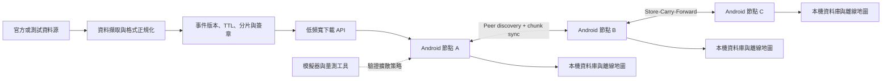

# ResilientGeo Mesh — 系統實作計畫

> 進度更新（2026-09-04）：v0 資料契約與本機可信資料管線已完成；Demo 場域定為**台北市內湖區**，已導入真實 OSM 地理的可重播資料集與 `(area_id, theme)` 地理分片。下一步先完成「階段 0」的 Android 實機傳輸 Spike，再進入單機 App。資料源仍是可重播快照（OSM snapshot ＋ TDX-shaped 輸入），不是即時 API 資料。

## 目前進度總覽

| 工作項目 | 狀態 | 已完成／尚缺 |
| --- | --- | --- |
| Event、Manifest、Chunk、Peer Summary v0 | 已完成 | `schemas/` 四份 JSON Schema 與 phase-0 fixture 已建立 |
| Phase-0 replay 與測試資料集 | 已完成 | 可重播新增、更新、過期、namespace 隔離與版本倒退；內湖 curated（~27）與 scale（~500）資料集已生成 |
| 階段 2：資料正規化 | 已完成 | `pipeline/lib/normalize.mjs` 可將 TDX-shaped input 轉為 unsigned Event v0 |
| 階段 2：hash、Ed25519、Manifest、Chunk | 已完成 | `pipeline/` 可簽署與驗證完整 bundle，私鑰只由 server-side CLI 使用 |
| 階段 2：安全測試 | 已完成 | Node 測試涵蓋竄改、版本 replay、TTL、incomplete chunk |
| 真實資料源 | 尚未開始 | 目前沒有呼叫 TDX／CWA／NCDR 即時 API |
| Android 驗證器與 App | 尚未開始 | 目前是 platform-neutral Node verifier，尚無 Android project、離線 DB 或地圖 UI |
| Android 實機傳輸 Spike | 尚未開始 | 尚未比較兩台實機上的 BLE、Nearby Connections、Wi-Fi Direct |
| Simulator／實驗報告 | 進行中 | `simulator/` 決定性模擬 10／20／50／100 節點 × 三策略 × 地理過濾；`experiments/` 有可重現的四指標報告（Coverage／Freshness／Cellular Savings／Transfer Efficiency）。傳輸參數待實機校準；Energy Cost 未建模 |

狀態證據：`npm test` 的 Node 測試 48 項通過（pipeline + simulator，含地理分片、bbox 竄改偵測、生成器與模擬器決定性、`matrix --check` 位元比對），`python -m unittest discover -s tests -v` 的 Python 測試 4 項通過；CLI 也已完成 keygen → build → verify 端到端測試（`demo-v136` 產生 22 個帶 area／theme 的已驗證分片）。正式 Android 驗簽、實機傳輸、真實來源接入與 Emergency Mode 實機耗電量測仍不能視為完成。

## 1. 專案目標

在行動網路低頻寬或局部斷線時，讓 Android 手機仍能：

1. 查看預先下載的離線地圖。
2. 接收少量、可驗證的災情增量更新。
3. 與附近手機交換缺少的更新資料。
4. 辨識資料來源、版本、時效與可信狀態。
5. 量測資料擴散速度、節省的行動流量與耗電量。

系統定位是「既有行動網路、衛星、LoRa、基地台車之外的額外韌性層」，不是取代既有通訊，也不宣稱能創造額外的基地台頻寬。

## 2. MVP 邊界

### MVP 必須完成

- **平台**：Android First，使用者手動開啟有明顯狀態提示的 Emergency Mode。
- **地圖**：一個測試區域的離線底圖與道路、避難所圖層。
- **資料**：先接一個官方或可重播的測試資料源，轉為統一事件格式。
- **同步**：2–5 台 Android 裝置能發現彼此，只交換缺少的事件分片。
- **可信度**：裝置在寫入資料前驗證雜湊、簽章、版本與 TTL。

### MVP 暫不處理

- iOS 背景 Relay 與 24 小時自動掃描。
- 全台所有 CWA、TDX、NCDR、消防署資料源一次整合。
- 群眾回報的信譽評分與多裝置共識。
- Fountain Code、Erasure Coding 與城市級自動分群。
- 災時正式上線、政府系統整合或安全認證。

## 3. 建議系統架構



### 五個模組

| 模組 | 責任 | MVP 產物 |
| --- | --- | --- |
| Data Pipeline | 擷取、正規化與版本化空間事件 | 可重播的 JSON/Protobuf 測試資料集 |
| Package & Trust | 建立 manifest、chunk、hash、signature、TTL | 能簽署與驗證的資料封包 |
| Android GIS | 儲存離線底圖與事件，顯示新鮮度 | 測試區域地圖與事件圖層 |
| Peer Sync | 發現 Peer、比較版本、交換缺少分片 | 2–5 台實機同步 Demo |
| Experiment Harness | 模擬密度、移動與網路條件 | Coverage、延遲、流量與耗電報告 |

## 4. 核心資料模型

第一版事件至少包含：

```json
{
  "event_id": "tdx:road:382",
  "event_type": "ROAD_CLOSED",
  "geometry": {},
  "severity": "HIGH",
  "source": "TDX",
  "source_version": "135",
  "issued_at": "2026-09-01T06:32:00Z",
  "expires_at": "2026-09-01T08:32:00Z",
  "payload_hash": "sha256:...",
  "signature": "base64:..."
}
```

資料套用規則：

1. 簽章或雜湊驗證失敗：拒絕寫入。
2. 同一 `event_id`：較新且可驗證的版本覆蓋舊版本。
3. 超過 `expires_at`：保留快取但標為過期，不當作目前狀態。
4. 官方資料與群眾回報使用不同 namespace，不能互相覆蓋。
5. 原始來源、接收時間與傳輸來源分開記錄，便於稽核。

## 5. Peer Sync 最小協定

一次連線只做五件事：

1. `HELLO`：交換節點能力、資料集版本與 manifest 摘要。
2. `DIFF`：計算雙方缺少或過期的 chunk。
3. `REQUEST`：依 critical、稀有度、大小與 TTL 排定下載順序。
4. `TRANSFER`：分段傳送，可中斷續傳；同時限制 Peer 數量。
5. `VERIFY/APPLY`：驗證 hash 與 signature 後，以原子方式寫入本機。

傳輸層必須藏在介面後方。階段 0 先用實機 Spike 比較 Nearby Connections 與原生 Wi-Fi Direct／BLE 的相容性、背景限制、速度和耗電，再決定 MVP 實作；不要讓資料同步邏輯綁死單一傳輸 API。

## 6. 開發階段與驗收條件

### 階段 0：證明關鍵假設（2–3 天）

- [x] 定義 Event、Manifest、Chunk 與 Peer Summary 的 v0 格式。（`schemas/`）
- [x] 準備 100–1,000 筆道路／避難所測試事件與更新序列。（`fixtures/neihu/scale-v136.json` ~500 筆，`demo-v136/137` 為更新序列；由 `tools/generate-neihu-fixtures.mjs` 從 OSM 快照決定性生成）
- [ ] 用兩台 Android 實機測 BLE 發現及一種高速 P2P 傳輸。
- [ ] 紀錄 1 MB、10 MB 的連線時間、傳輸速度、斷線恢復結果。
- [x] 寫出 ADR-001：MVP 傳輸層選擇與未選方案的原因。（目前狀態為 Proposed，待實機 Spike 定稿）

**通過條件**：兩台指定測試機可重複完成發現、連線、傳輸、斷線重試；否則先調整傳輸方案，不進入 UI 開發。

### 階段 1：單機離線系統（第 1 週）

- [ ] 顯示一個測試區域的離線底圖。
- [ ] 用本機資料庫保存事件、版本與到期時間。
- [ ] 將測試事件套到地圖，清楚標示有效、過期與未驗證。
- [x] 完成 delta 套用及新版本覆蓋規則的單元測試。（目前為 pipeline／Python replay 測試，尚未接 Android DB）

**通過條件**：關閉網路後重啟 App，地圖與最後資料仍可讀；舊事件不能覆蓋新事件。

### 階段 2：可信資料管線（第 2 週）

- [x] 將一個資料源正規化為 v0 Event。（TDX-shaped 模擬輸入；尚非即時 API）
- [x] 產生 manifest 與固定大小或內容導向的 chunk。
- [ ] 在伺服器端簽署，在 Android 端驗證；私鑰不進 App。（已完成 server-side Node signing 與 platform-neutral verifier，Android adapter 尚未建立）
- [x] 測試竄改、重播、過期與不完整封包。（Node pipeline tests）

**通過條件**：合法資料可寫入；任一位元遭修改、版本倒退或 TTL 到期時，App 都不把它顯示為目前有效資料。

**目前狀態**：資料管線與驗證規則已在 Node 測試中通過；因尚無 Android App，尚未宣告本階段的 App-level acceptance 通過。

### 階段 3：多機同步 Demo（第 3–4 週）

- [ ] 兩台手機只交換彼此缺少的 chunk。
- [ ] 實作斷線續傳、Peer 上限與 critical-first 排程。
- [ ] 用第三台手機驗證 Store-Carry-Forward。
- [ ] 擴到 5 台裝置，記錄重複傳輸與同步完成時間。

**通過條件**：A 不直接連到 C 時，更新仍能經 B 到達 C；所有收到的資料都通過簽章驗證，且沒有從伺服器重複下載完整資料集。

### 階段 4：實驗與展示（第 5 週）

- [x] 建立 10、20、50、100 節點的可重播模擬情境。（`simulator/`，固定 seed ＋ `sim-config.json` ⇒ 位元相同，`matrix --check` 守住）
- [x] 比較無協作、一般 replication、rarest-first 三種策略。（外加正交的地理相關性過濾開關）
- [ ] 實機量測 Emergency Mode 的耗電與傳輸量。（Energy Cost 尚未建模，需指定機型實機量測）
- [x] 產生 Demo 腳本、限制說明與結果圖表。（`experiments/{demo,limitations}.md`、`results/report.md` 含 ASCII 曲線、`analysis/*.csv`）

**通過條件**：報告可重現，不宣稱固定時間覆蓋全城；所有成果都附測試條件與樣本數。

**目前狀態**：四個指標（Data Coverage、Freshness Lag、Cellular Savings、Transfer Efficiency）已在 `experiments/results/report.md` 產出且可重現（`matrix --check` PASS），每個區塊帶樣本數與 Limitations。接觸機率與 P2P 傳輸參數是工程估計值，待組員 C 的兩台實機 spike 校準（改 `simulator/fixtures/sim-config.json` 一檔即可重跑）。Energy Cost 因需實機量測，本階段尚未宣告完成。

## 7. 必須量測的指標

| 指標 | 定義 | 第一版目標 |
| --- | --- | --- |
| Data Coverage | 指定時間內取得最新事件的節點比例 | 產出 T+1/3/5/10 min 曲線 |
| Freshness Lag | 事件發布到節點成功套用的時間 | 報告 p50、p95，不先承諾絕對值 |
| Cellular Savings | 相對每台各自下載所減少的伺服器流量 | 在固定情境下可重現 |
| Transfer Efficiency | 有效 payload／總 P2P 傳輸量 | 記錄重複與失敗傳輸比例 |
| Energy Cost | Emergency Mode 每小時額外耗電 | 指定機型、電量及掃描頻率 |

## 8. 主要風險與停止條件

| 風險 | 先做的控制 | 停止／改案條件 |
| --- | --- | --- |
| Android 背景限制 | MVP 使用前景服務與明確 Emergency Mode | 鎖屏後無法穩定完成最小同步 |
| 裝置相容性 | 至少兩個品牌、兩個 Android 版本實測 | 傳輸層只能在單一機型運作 |
| 過期或倒退資料 | 簽章、單調版本、TTL、來源優先序 | 無法可靠拒絕舊資料時不進入展示 |
| 電量消耗 | 掃描退避、電量門檻、critical-first | 一小時測試耗電超出可接受門檻時降低掃描頻率 |
| 密度不足 | 明確定位為額外韌性層 | 不以 Mesh 單獨承諾偏遠地區覆蓋 |

## 9. 建議儲存庫結構

```text
docs/                 決策紀錄、協定、實驗設計
schemas/              Event、Manifest、Chunk schema
pipeline/             資料擷取、正規化、分片、簽章
android/              Android App、離線 GIS、Peer Sync（尚未建立）
simulator/            DTN／擴散模擬與情境設定（已建立）
experiments/          原始結果、分析腳本與圖表（已建立）
fixtures/             可重播的測試資料，不放正式私鑰
```

## 10. 第一個工作時段（約 90 分鐘）

1. **20 分鐘**：建立 `schemas/event-v0.schema.json`，固定欄位型別與必填值。
2. **20 分鐘**：建立 `schemas/manifest-v0.schema.json`，定義 chunk hash、大小與優先序。
3. **20 分鐘**：建立兩批測試 fixture，包含新增、更新、過期與版本倒退事件。
4. **15 分鐘**：寫出裝置 A/B 預期的 `HELLO → DIFF → REQUEST` 範例。
5. **15 分鐘**：建立 ADR-001 空白模板，列出實機 Spike 要記錄的數據。

完成標誌：不需要 App UI，也能用固定 fixture 清楚回答「哪筆資料更新、哪個 chunk 缺少、哪筆資料必須被拒絕」。

**完成狀態（2026-09-02）**：上述資料契約、fixture、HELLO／DIFF／REQUEST 範例與 ADR 已完成；另已補上可產生真實 Ed25519 bundle 的本機 pipeline 與測試。下一個工作時段應優先處理階段 0 實機 Spike，而不是直接宣稱 Android MVP 完成。
